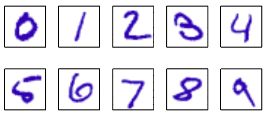

从数据中寻找模式是一个基础问题，它有着很长的成功史。例如：16世纪，Tycho Brahe（第谷·布拉赫）的大量天文观测使得Johannes Kepler（开普勒）发现了行星运动的经验规律。这反过来为经典力学的发展提供的跳板。同样的，原子光谱规律的发现在20世纪初的量子力学的发展和验证起着主要作用。模式识别领域主要关注利用计算机算法来自动发现数据中的规律，以及利用这些规律对数据进行分类等操作。    

考虑对 图1.1 中的手写数字进行识别的问题。每一个数可以由28*28个像素的图像也就是784个实数向量来表示。我们的目的是建立一个以这样的向量作为输入并能识别0...9这些数字作为输出的机器。手写的多样性导致这不是一个简单的问题。这个问题可以用人工编写规则或根据数字的笔迹来区分它们，但是实际上这样的方法会导致规则激增及不符合规则的例外等问题，导致得到并不理想的结果。    
    
   图 1.1: 来自美国邮政编码的手写数字的例子    

一种使用 由$$ N $$ 个数字 $$｛x_1,x_2,...x_N｝$$ 组成的大集合作为训练集（training set）来调节所采用模型的参数的机器学习方法会得到好得多的结果。训练集中的结果通常被我们独立考察、人工标注而事先知道。我们可以通过目标向量（target vector） $$ t $$ 表示并区分这些数字。使用向量来表示类别的技术我们将在后面介绍。注意对每个数字图像 $$ x $$ 只有一个目标向量 $$ t $$ 与之对应。    

这种机器算法的结果可以由以新的数字图像 $$ x $$ 作为输入，并输出与目标向量形式相同的向量 $$ y $$ 的函数 $$ y(x) $$ 来表示。
$$ y(x) $$ 的精确度是由训练阶段（training phase 也叫学习阶段 learning phase）决定的。一旦模型训练好我们就可以识别测试集合（test set)中新的数字图像。识别与训练集不同的新样本的精确度叫做泛化（generalization）。在实际情况中我们的训练集只是所有可能输入的一小部分，所以泛化是模式识别的中心问题。     

在大部分实际应用中，为了能更容易的处理模式识别问题我们会对原始数据做预处理（perprocessed）把它们转换到新的空间。例如：在数字识别问题中，对数字的图像进行变换和伸缩，使得每个数字可以用大小固定的盒子来表达。现在所有数字的位置和大小都相同，这极大地减少了每个数字类的变化性，使后续区别不同类别的模式识别算法更加容易。这样的预处理我们有时也把它称为特征抽取（feature extraction）。注意新的测试数据必须和训练数据做一样的预处理。    

有时我们为了加快计算速度也会进行预处理。例如：我们需要实时的从高清视频流中识别出人脸，计算机每秒钟需要处理大量的像素，将这些像素直接传给复杂的模式识别算法在计算上是不可行。因此我们需要找到可以快速计算的有效特征，这些特征保留区别人脸和其他的信息。这些特征被当作模式识别算法的输入。例如：一块矩形子域的图像灰度的平均值是可以很快计算出来的（Viola and Jones,
2004），而且这样的特征被证明在快速人脸识别中是很有效的。因为这样的特征数量是小于像素数的，所以这样的预处理代表了一种维数降低形式。大多数预处理都会导致信息丢失，所以我们必须要格外注意。如果对于问题处理很重要的信息丢失的话会导致系统精度大幅下降。     

训练样本同时包含输入向量以及对应的目标向量的应用被称为监督学习（supervised learning）问题。数字识别就是这样的一个问题，像这样把输入向量分配到有限的离散类别中的一个的被称为分类（classification）问题。如果期望的输出是一个或多个连续变量，那么我们就把它称为回归（regression）问题。化工生产过程中的产量的预测就是这样的一个问题，它的输入由反应物、温度、压力组成。     

在其他的模式识别问题中,训练数据只由一组输入向量 $$ x $$ 组成,没有任何对应的目标值。这就是无监督学习（unsupervised learning）。它的目标可能是在数据中发现相同的样本分组，我们把这叫做聚类（clustering），或者是把高维空间投影到2或3维空间中，这就叫数据可视化（visualization）。    

最后，反馈学习(reinforcement learning)(Sutton and Barto, 1998)技术关注的问题是在给定的条件下,找到合适的动作,使得奖励达到最大值。它不像监督学习一样给定最优输出用例，而是需要在一系列的实验和错误中发现。通常学习算法有一套和环境交互的状态和动作序列。大多数情况下当前的动作同时影响当前和所有后续的奖励。例如：通过合适的反馈学习技术，一个神经网络可以成为西洋双陆棋（Backgammon）的高手(Tesauro, 1994)。这里神经网络必须学习把一大组
位置信息、骰子投掷的结果作为输入，产生一个移动的方式作为输出。这可以通过神经网络自己和自己玩数百万局来完成。主要的挑战来自于奖励是在经过大量的移动使游戏结束后以胜利的形式给出。奖励必须被合理地分配给所有引起胜利的移动步骤。这些移动中，有些移动很好，其他的移动不是那么好。这是信用分配(credit assignment)问题的一个例子。反馈学习的一个重要特征是在探索(exploration)和利用(exploitation)间做一个权衡。“探索”是指系统尝试新类型的动作,“利用”是指系统使用已知能产生较高奖励的动作。过分地集中于探索或者利用都会产生较差的结果。反馈学习一直是机器学 习研究中得一个活跃的领域。然而,详细讨论反馈学习不在本书的范围内。    

尽管这样的任务都有自己的工具和技术，但是支撑它们的大部分关键思想还是相通的。本章的主要目标是以一种相对非正式的形式介绍最重要的概念，并使用简单的例子来说明。在之后，我们将会看到同样的思想以更加复杂的能应用于真实世界的模式识别应用中的模型形式重新出现。本章也将介绍将自始至终在本书中使用的三个重要工具：概率论、决策论、信息论。虽然这些东西听起来让人感觉害怕，但是实际上它们非常直观。并且，如果想让机器学习技术在实际应用中发挥最大作用的话，必须要清楚地理解它们。
