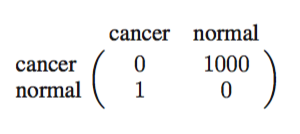

大部分应用中，我们的目标不会只是最小化误分类的数量这么简单。让我们再次考虑医学诊断问题。注意，如果误诊断病人患有癌症，后果是一些病人窘迫的进行进一步的诊断。相反的，如果误诊断病人未患癌症，那么他可能由于得不到治疗而过早的死亡。两种误分类导致的后果是完全不同的。很明显，即使会导致第一种误分率上升，越少的第二种误分数量越好。    

通过引入损失函数（loss function）或cost function（成本函数）可以形式化这样的问题。它是对所有可能的决策或动作所产生的损失的一种统一的整体度量。目标是最小化整体的损失。一些作者使用最大化效用函数（utility
function）来替代。如果让效用函数等于负的损失函数的话，那么它们是等价的，因此在本书中我们都将使用损失函数这个概念。假设新的值$$ x $$，它的实际类别是$$ C_k $$，但我们把它分到了$$ C_j $$中（其中$$ j $$可能等于也可能不等于$$ k $$），这样做之后会产生某种程度的损失，记作$$ L_{kj} $$也就是损失矩阵（loss matrix）的第$$ i,j $$项。举个例子，图1.25展示了癌症例子的损失矩阵。

      
图 1.25: 损失矩阵

这个具体的损失矩阵表示对于正确的分类是不会产生损失的，对于误诊断为癌症时损失为1，误诊断为未患癌症时损失为1000。    

最优解是最小化损失函数，然而，损失函数依赖于未知的正确类别。给定输入向量$$ x $$，对正确分类的不确定性由联合概率分布$$ p(x, C_k) $$表示，所以用最小化平均损失来替代。关于这个分布的平均损失：    

$$
\mathbb{E}[L] = \sum\limits_k\sum\limits_j\int_{R_j} L_{kj}p(x, C_k)dx \tag{1.80}
$$

每一个$$ x $$可以被独立地分到决策区域$$ R_j $$中。目标是选择决策区域$$ R_j $$来最小化损失期望（1.80），这隐含了对于每个$$ x $$最小化$$ \sum_kL_{kj}p(x, C_k) $$。与之前一样可以是用乘法规则$$ p(x, C_k) = p(C_k|x)p(x) $$来消除公共项$$ p(x) $$。所以,最小化损失期望的决策规则是对于每个新的$$ x $$，把它分到能使下式：   

$$
\sum\limits_kL_{kj}p(C_k|x)
$$

取得最小值的第$$ j $$类。当知道了类的后验概率$$ p(C_k|x) $$之后就很容易了。
