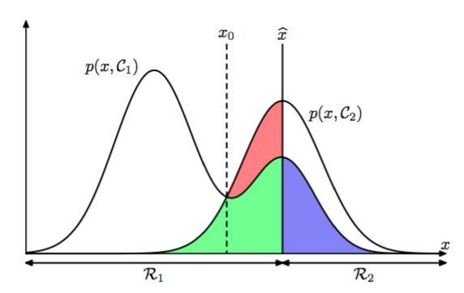

假设我们的目标是简单的尽可能的少做出错误的分类。我们需要一个规则把每个$$ x $$分到一个可用的分类中，这样的规则把输入空间切分成区域$$ R_k $$，称为决策区域（decision regions）。每个类别对应一个决策区域，如$$ R_k $$中所有点都被分为类$$ C_k $$。决策区域间的边界被称为决策边界（decision boundaries）或决策面（decision
surfaces）。注意一个决策区域不一定要连续的，可以由几个分离的区域组成。后续的章节中，我们会给出决策边 界和决策区域的例子。为了找到最优的决策规则，先考虑只有两种类别的情况，就像癌症问题一样。错误发生在把属于$$C_1 $$的分到了$$ C_2 $$中，反之亦然。发生这种情况的概率为：    

$$
\begin{eqnarray}
p(mistake) = p(x \belong R_1, C_2) + p(x \ belong R_2, C_1) \\ 
= \int_{R_1} p(x, C_2)dx + \int_{R_2} p(x, C_1)dx  \tag{1.78}
\end{eqnarray}
$$

可以随意选择把点$$ x $$分到两类中的一类的决策规则。很明显为了最小化$$ p(mistake) $$对于$$ x $$的分类结果应该让公式（1.78）中被积函数尽可能的小。因此，对于$$ x $$如果$$ p(x, C_1) > p(x, C_2) $$，那么就把$$ x $$分到类$$ C_1 $$中。根据乘积规则得到$$ p(x, C_k) = p(C_k|x)p(x) $$。由于两项的因子$$ p(x) $$是相同的，所以可以重新定义结果：最小化错误分类的概率可以通过把$$ x $$分到使后验概率$$ p(C_k|x) $$最大的分类中。图1.24展示了一元输入变量$$ x $$的二元分类问题

      
图 1.24: 二元类别的联合概率分布

对于更一般的$$ K $$类的情形，最大化正确率会稍微简单一些，即最大化：    

$$
\begin{eqnarray}
p(correct) = \sum\limits_{k=1}^K p(x \belong R_k, C_k) \\
= \sum\limits_{k=1}^K\int_{R_k}p(x, C_k)dx \tag{1.79}
\end{eqnarray}
$$

当区域$$ R_k $$的选择使得每个$$ x $$的分类得到的$$ p(x, C_k) $$最大时，上式取到最大值。再一次使用 乘法规则$$ p(x, C_k) = p(C_k | x)p(x) $$，并且因子$$ p(x) $$对于所有项都相同，可以得到每个$$ x $$都应该被分到有最大后验概率$$ p(C_k|x) $$的类别中。
