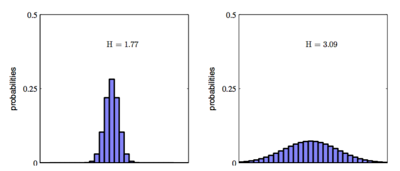

在本章中我们大量的讨论的概率论和决策论的概念，这些概念组成了本书后续讨论的基础。现在，介绍一些在模式识别和机器学习中都很有用的信息论概念来结束本章。再强调一次，我们只讨论核心概念，关于更加详细的讨论，读者可以参考（Viterbi and Omura, 1979; Cover and Thomas, 1991; MacKay, 2003）。    

首先，考虑一个离散的随机变量$$ x $$，当观察到这个变量的一个具体值的时候，我们接收到了多少信息呢？信息量可以被看成在学习$$ x $$值的时候的“惊讶度（degree of surprise）”。当有人告诉我们一个相当不可能的事件发生后，收到的信息要多于我们被告知某个很可能发生的事件
发生时收到的信息，并且，如果该事件必然发生那我们没有接收到任何信息。所以，对于信息内容的度量依赖于概率分布 $$ p(x) $$，于是我们想要找到一个函数$$ h(x) $$，它是概率$$ p(x) $$的单调递增函数，并表达了信息的内容。$$ h(·) $$的公式可以这样寻找：如果两个事件$$ x, y $$是不相关的，那么我们观察到两个事件同时发生时获得的信息应该等于观察到事件各自发生时获得的信息之和，即$$ h(x, y) = h(x) + h(y) $$。两个不相关事件是统计独立的，所以$$ p(x, y)
= p(x)p(y) $$。根据这两个关系，很容易得出$$ h(x) $$一定可以由$$ p(x) $$的对数给出：

$$
h(x) = -log_2p(x) \tag{1.92}
$$

其中的负号保证我们的信息是非负的。注意，低概率事件$$ x $$对应于大信息量。对数的底是任意选择的，现在我们遵守信息论的普遍传统，使用2作为对数的底。在这种情形下，正 如稍后会看到的那样，$$ h(x) $$的单位是比特（bit，binary digit）。    

现在假设一个发送者想传输一个随机变量的值给接收者。这个过程中，他们传输的平均信息量通可以通过求公式（1.92）关于概率分布$$ p(x) $$的期望得到：

$$
H[x] = -\sum\limits_xp(x)log_2p(x) \tag{1.93}
$$

这个重要的量被叫做随机变量$$ x $$的熵（entropy）。注意，$$ lim_{p \to 0}plog_2p = 0 $$，所以只要遇到一个$$ x $$使得$$ p(x) = 0 $$，那么我们就应该令$$ p(x)log_2p(x) = 0 $$。    

目前为止，对于公式（1.92）信息的定义以及对应的公式（1.93）熵的定义，我们已经有了一 种启发式的动机。现在展示这些定义的重要作用：假设一个随机变量$$ x $$有8种可能的状态，每种状态都是等可能的。为了把$$ x $$的值传给接收者，我们需要传输一个3比特的消息。注意,这个变量的熵：    

$$
H[x] = -8 × \frac{1}{8}log_2\frac{1}{8} = 3 bits
$$

现在考虑一个具有8种可能状态$$ \{a,b,c,d,e,f,g,h\} $$的随机变量，每个状态各自的概率为$$ (\frac{1}{2},\frac{1}{4},\frac{1}{8},\frac{1}{16},\frac{1}{64},\frac{1}{64},\frac{1}{64},\frac{1}{64}) $$(Cover and Thomas, 1991)。这种情形下的熵为

$$
H[x] = -\frac{1}{2}log_2\frac{1}{2} -\frac{1}{4}log_2\frac{1}{4} -\frac{1}{8}log_2\frac{1}{8} -\frac{1}{16}log_2\frac{1}{16} -\frac{4}{64}log_2\frac{1}{64} = 2bits
$$

我们得到，非均匀分布比均匀分布的熵要小。后面当根据无序程度来讨论熵的概念时，会获得一些更深刻的认识。现在，考虑如何把变量状态传递给接收者。可以和之前一样，使用3比特来完成。但是，我们可以利用非均匀分布这个特点，使用更短的编码来描述更可能的事件，更长的编码来描述不太可能的事件。希望这样做能够得到一个更短的平均编码长度。使用下面的编码串：0、10、110、1110、 111100、111101、111110、111111来表示状态$$ \{a, b, c, d, e, f, g, h\} $$。传输的编码的平均长度就是

$$
\text{average code length} = \frac{1}{2}×1 + \frac{1}{4}×2+\frac{1}{8}×3+ \frac{1}{16}×4+4×\frac{1}{64}×6 = 2bits
$$

这个值与随机变量的熵相等。注意，不能使用更短的编码串，因为必须能够从多个这种字符串的拼接中分割出各个独立的字符串。例如，11001110唯一地编码了状态序列c, a, d。    

熵和最短编码长度的这种关系是一种普遍的情形。无噪声编码定理（noiseless coding theorem）（Shannon, 1948）表明，熵是传输一个随机变量状态值所需的比特位的下界。    

现在开始，为了使熵的概念与本书后续章节中的思想结合起来比较方，便我们会把熵的定义中的对数变成自然对数。这样熵的度量的单位是nat，而不是bit。两者的差别是一个$$ ln 2 $$的因子。

我们已经通过具体的随机变量的状态所需的平均信息量介绍了熵的概念。事实上，熵的概念最早起源于物理学中的热力学平衡。后来，熵成为描述统计力学中的无序程度的度量。我们可以这样理解熵的这种含义：考虑一个包含N个完全相同的物体的集合，这些物体要被分到若干个箱子中，使得第$$ i $$个箱子中有$$ n_i $$个物体。考虑把物体分配到箱子中的不同方案的数量。有N种方式选择第一个物体，有(N − 1)种方式选择第二个物体，以此类推，总共有$$ N!
$$种方式把N个物体分配到箱子中, 其中$$ N! $$表示乘积$$ N × (N − 1) × ··· × 2 × 1 $$。但是，我们不想区分同一个箱子中同样元素的不同排列。在第$$ i^th $$个箱子有$$ n_i! $$种排列方式。那么把N 个物体分配到箱子中的总方案数量为：    

$$
W = \frac{N!}{\prod_in_i!} \tag{.194}
$$

这被称为多重性（multiplicity）。熵被定义为多重性的对数乘以一个适当的缩放常数，即：    

$$
H = \frac{1}{N}\ln W = \frac{1}{N} \ln N! - \frac{1}{N}\sum\limits_i \ln n_i! \tag{1.95}
$$

现在我们考虑在$$ n_i / N $$固定的情况下，$$ N \to \infty $$使用Stirling’s近似：    

$$
\ln N! \simeq N\ln N - N \tag{1.96}
$$

得出：

$$
H = - \lim\limits_{N \to \infty}\sum\limits_{i}(\frac{n_i}{N})\ln(\frac{n_i}{N}) = -\sum\limits_ip_i\ln p_i \tag{1.97}
$$

其中$$ \sum_in_i = N $$，$$ p_i = \lim_{N \to \infty}(\frac{n_i}{N}) $$是一个物体被分配到第$$ i $$个箱子的概率。使用物理的术语，箱子中物体的具体分配方案被称为微观态（microstate），整体的占有数分布，表示为比值$$ n_i / N $$叫做宏观态（macrostate）。多重性W也被称为宏观态的权重。    

我们可以用离散随机变量$$ X $$的状态$$ x_i $$来表示箱子，其中$$ p(X = x_i) = p_i $$。随机变量X的熵为：    

$$
H[p] = -\sum\limits_ip(x_i)\ln p(x_i) \tag{1.98}
$$

如果分布$$ p(x_i) $$有多个尖锐的峰值，那么熵相对较小。相反的，如果分布$$ p(x_i) $$相对比较平缓，那么熵就会相对大，就像图1.30展示的那样。

      
图 1.30: 两个概率分布在30个箱子上的直方图

应为$$ 0 \leq p_i \leq 1 $$，熵是非负的。当$$ p_i = 1 $$且所有其他的$$ p_{j \neq i} = 0 $$时，熵取得最小值0。在概率标准化的限制下，使用拉格朗日乘数法可以找到熵的最大值。即：    

$$
\widetilde{H} = -\sum\limits_ip(x_i)\ln p(x_i) + \lambda(\sum\limits_i p(x_i) - 1) \tag{1.99}
$$

可以证明，当所有的$$ p(x_i) $$都相等，且值为$$ p(x_i) = 1 / M $$时，熵取得最大值，其中M是状态$$ x_i $$的总数。此时对应的熵值为$$ H = \ln M $$。这个结果也可以通过Jensen不等式推导出来(稍后会简短的介绍一下)。为了证明驻点确实是最大值，我们可以求熵的二阶导数，即：    

$$
\frac{\partial^2\widetilde{H}}{\partial p(x_i)\partial p(x_j)} = -I_{ij}\frac{1}{p_i} \tag{1.100}
$$

其中$$ I_{ij} $$是单位矩阵的元素。    

我们可以把熵的定义扩展到连续变量$$ x $$的概率分布$$ p(x) $$，方法如下。首先把x切分成宽度为$$ \Delta $$的箱子。然后假设$$ p(x) $$是连续的。使用均值定理（mean value theorem）（Weisstein, 1999）得到对于每个这样的箱子，一定存在一个值$$ x_i $$使得    

$$
\int_{i\Delta}{(i+1)\Delta} p(x)dx = p(x_i)\Delta \tag{1.101}
$$

我们现在可以这样量化连续变量x：只要x落在第i个箱子中，我们就把x赋值为$$ x_i $$。因此观察到值$$ x_i $$的概率为$$ p(x_i )\Delta $$。这就变成了离散的分布，这种情形下熵为：    

$$
H_\Delta = -\sum\limits_ip(x_i)\Delta\ln(p(x_i)\Delta) = -\sum\limits_ip(x_i)\Delta \ln p(x_i) - \ln \Delta \tag{1.102}
$$

推导时我们使用了$$ \sum_ip(x_i)\Delta = 1 $$，这可以由公式(1.101)得出。我们现在省略公式(1.102)右侧的第二项$$ \ln\Delta $$，然后考虑极限$$ \Delta \to 0 $$。在这种极限下，公式(1.102)右侧的第一项就变成了$$ p(x)\ln p(x) $$的积分，因此

$$
\lim\limits_{\Delta \to 0}\{\sum\limits_ip(x_i)\Delta\ln p(x_i)\} = -\int p(x)\ln p(x)dx \tag{1.103}
$$

其中，右侧的量被称为微分熵（differential entropy）。我们看到，熵的离散形式与连续形式的差是$$ \ln\Delta $$,这在极限$$ \Delta \to 0 $$的情形下发散。这反映出一个事实：具体化一个连续变量需要大量的比特位。对于定义在多元连续变量（由向量x共同表示）上的概率密度，微分熵为：

$$
H[x] = -\int p(x) \ln p(x)dx \tag{1.104}
$$

在离散分布中，最大熵对应的是变量的所有可能状态的均匀分布。现在让我们 考虑连续变量的最大熵。为了让这个最大值有一个合理的定义，有必要限制$$ p(x) $$的一阶矩和二阶矩，同时还要保留标准化限制。因此我们最大化微分熵的时候要遵循下面三个限制：

$$
\begin{eqnarray}
\int_{-\infty}^{\infty}p(x)dx = 1 \tag{1.105} \\
\int_{-\infty}^{\infty}xp(x)dx = \mu \tag{1.106} \\
\int_{-\infty}^{\infty}(x - \mu)^2p(x)dx = \delta^2 \tag{1.107}
\end{eqnarray}
$$

带有限制条件的最大化问题可以使用拉格朗日乘数法求解,因此我们要最优化下面的关于$$ p(x) $$的函数

$$
\begin{eqnarray}
&-& \int_{-\infty}^{\infty} p(x)\ln p(x)dx + \lambda_1(\int_{-\infty}^{\infty}p(x)dx - 1) \\
&+& \lambda_2(\int_{-\infty}^{\infty} xp(x)dx - \mu) + \lambda_3(\int_{-\infty}^{\infty} (x - \mu)^2p(x)dx - \delta^2)
\end{eqnarray}
$$

使用变分法（calculus of variations），令这个函数的导数等于零，我们有：

$$
p(x) = exp{-1 + \lambda_1 + \lambda_2x + \lambda_3(x - \mu)^2} \tag{1.108}
$$

将这个结果代入三个限制方程中，即可求出拉格朗日乘数，最终的结果为

$$
p(x) = \frac{1}{(2\pi\delta^2)^{1/2}}exp\left\{-\frac{(x - \mu)^2}{2\delta^2}\right\} \tag{1.109}
$$

因此最大化微分熵的分布是高斯分布。注意，在最大化熵的时候，我们没有限制概率分布非负。然而，求出的分布确实是非负的，因此可以得出结论：这种限制是不必要的。

如果我们求高斯分布的微分熵，我们会得到：

$$
H[x] = \frac{1}{2}\{1 + \ln(2\pi\delta^2)\} \tag{1.110}
$$

因此我们看到熵随着分布宽度（即$$ \delta^2 $$）的增加而增加。与离散熵不同，当$$ \delta^2 < 1 / (2\pi e) $$是，熵为负。    

假设我们有一个联合概率分布$$ p(x, y) $$。我们从这个概率分布中抽取了一对$$ x $$和$$ y $$。如果$$ x $$的值已知,那么需要确定对应的y值所需的附加的信息就是$$−\ln p(y|x) $$。因此，用来确定y值的平均附加信息可以写成：    

$$
H[y|x] = - \int\int p(y,x)\ln p(y|x)dydx \tag{1.111}
$$

这被称为给定x的情况下，y的条件熵。使用乘积规则，很容易得出条件熵满足下面的关系：    

$$
H[x,y] = H[y|x] + H[x] \tag{1.112}
$$

其中，$$ H[x, y] $$是$$ p(x, y) $$的微分熵，$$ H[x] $$是边缘分布$$ p(x) $$的微分熵。因此，描述x和y所需的信息是描述x自己所需的信息，加上给定x的情况下具体化y所需的额外信息。    

