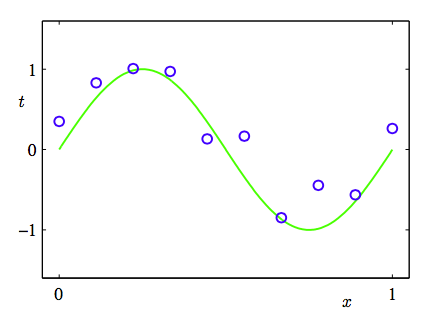
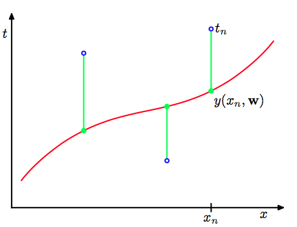
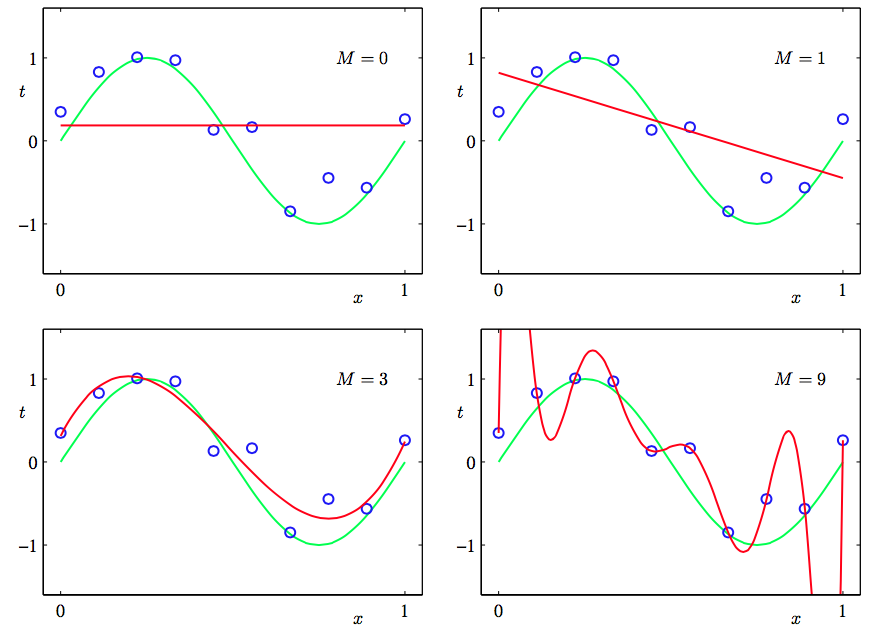
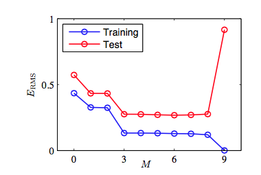
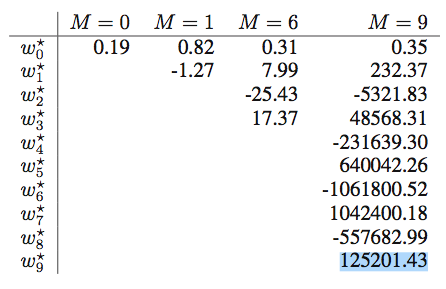
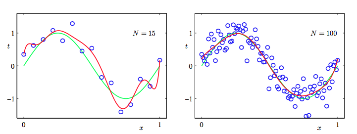
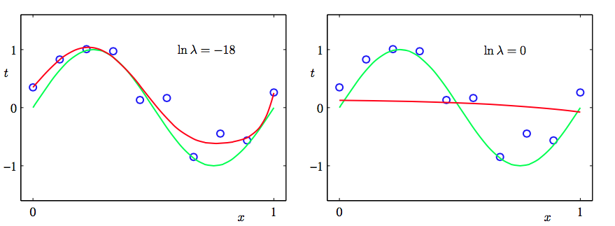
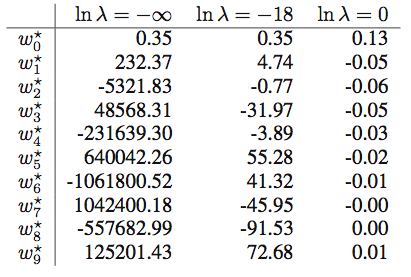
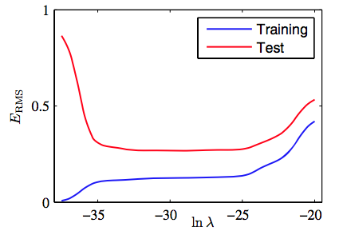

我们以一个贯穿本章用来阐述很多关键思想的简单的回归问题作为开始。假设我们观察到一个实输入变量 $$ x $$ 并利用这个变量来预测我们的实目标变量 $$ t $$ 。对于这个目的，一个很好的方法是考虑使用人工合成的数据，因为这样我们就精确的知道数据的生成过程，从而能够与学习到的模型作比较。这个例子的数据是由函数 $$ sin(2\pi x) $$ 目标变量带有随机噪音。详细的描述见附录A。     

现在我们考虑一个由 $$ N $$ 个观测量 $$ x $$ ，被记作 $$ X \equiv (x_1,...,x_N)^T $$,和对应的目标变量$$ t $$，被记作$$ T \equiv (t_1,...,t_N)^T $$。图1.2展示了由$$ N = 10 $$个数据点组成的图像。图1.2的输入集合$$ X $$ 是通过选择$$ x_n(n=1,...,N) $$来生成的。$$ x_n $$ 均匀的分布在区间 $$ [0, 1] $$。对应的目标向量$$ t_n $$是由函数 $$ sin(2\pi x) $$ 加上一个小的符合高斯
分布的随机噪声（高斯分布在1.2.4节中说明）。通过这种方法我们获取到一个拥有潜在的规律性的大量真实数据集，我们希望通过学习获得这种规律性。这个数据是受随机噪声干扰的。噪声可能由本质随机的过程产生，如：放射性衰变。但是更典型的情况是由于存在没有被观察到的变化性的噪声源。    

    
   图 1.2: 由$$ N = 10 $$个数据点组成的训练集的图像,用蓝色圆圈标记。每个数据点由输入变量$$ x $$的观测以及 对应的目标变量$$ t $$组成。绿色曲线给出了用来生成数据的$$ sin(2\pi x) $$函数。我们的目标是对于某些新的$$ x $$值, 预测$$ t $$的值,而无需知道绿色曲线。

我们的目标是利用这个训练集，对新的输入变量$$ \hat{x} $$预测出目标变量$$ \hat{t} $$。和我们将要看到的一样，这涉及到隐式地发现基础函数$$ sin(2\pi x) $$。这个问题本质上是比较困难的，因为我们需要从有限的数据集中生成。而且我们的数据是受噪声干扰的，这导致对于$$ \hat{x} $$对应的 $$ \hat{t}
$$具有不确定性。概率论(我们在1.2节中讨论)提供了一个用来以精确的数学的形式描述这种不确定性的框架。决策论（在1.5节中讨论）让我们可以利用这种概率的表示，以合适的标准进行最优的预测。    

但是现在,我们用一种简单的曲线拟合来考虑和处理这样的信息。我们将使用下面形式的多项式函数来进行数据拟合。    
$$
\begin{equation}
y(x, w) = w_0 + w_1x + w_2x^2 +...+w_mx^m = \sum\limits_{j=0}^{m}w_jx^j \tag{1.1}
\end{equation}
$$    
其中$$ m $$是这个多项式的阶数，$$ x^j $$表示$$ x $$的$$ j $$次幂。系数$$ w_0,...w_m $$整体记作向量$$ w $$。
注意,尽管多项式函数$$ y(x, w) $$是一个关于$$ x $$的非线性函数，但他时关于系数$$ w $$的线性函数。我们把这样的具有关于未知参数是线性的这一重要性质的多项式称为线性模型。将在第三、四章进行详细讨论。    

系数的值通过对训练集关于多项式拟合确定。这可以采用最小化误差函数（error function）的方法来取得。误差函数是对于确定的$$ w $$值所得到的$$ y(x, w) $$与训练集之间的差别。一种广泛使用的简单的选择是把每一个数据$$ x_n $$对应的目标值$$ t_n $$与它的预测值$$ y(x_n, w) $$之间的平方差的和作为误差函数。所以我们需要最小化：    
$$
\begin{equation}
E(w) = \frac{2}{1} \sum\limits_{n=1}^N{y(x_n, w) - t_n}^2 \tag{1.2}
\end{equation}
$$    
这个$$ \frac_{2}^{1} $$因子是为了后面计算方便。在这章的后面环节我们将讨论选择这个误差函数的动机。现在，简单的提示：这是一个非负的量，当且仅当函数$$ y(x, w) $$ 完全穿过训练集中的每一个点。图1.3阐释了平方和误差函数的几何意义。     

      
图 1.3: 误差函数(1.2)对应于每个数据点与函数$$ y(x, w) $$之间位移(绿色垂直线)的平方和    

我们可以通过选择$$ w $$的值使得$$ E(w) $$尽可能的小来解曲线拟合问题。因为误差函数是关于系数$$ w $$的二次函数，所以它的导数是关于系数的线性函数。因此我们可以得到最小化误差函数的唯一解析解，记作$$ w^* $$。最终的多项式函数由$$ y(x, w^*) $$给出。    

那么剩下的问题就是如何选择多项式的阶数$$ m $$，正如我们将要看到的，这是一个被称为模型对比（model comparison）或模型选择（model selection）的重要概念的一个例子。在图1.4中展示了以图1.2中数据分别使阶数$$ m = 0, 1, 3, 9 $$做多项式拟合的例子。 

      
图 1.4: 不同阶数的多项式曲线,用红色曲线表示,拟合了图1.2中的数据集。    

我们看到常数($$ m = 0 $$)和一阶($$ m = 1 $$)多项式对于数据的拟合效果相当差,很难代表函数$$ sin(2\pi x) $$。
图1.4中的三阶（$$ m ＝ 3 $$）多项式似乎对函数$$ sin(2\pi x) $$作了很好的拟合。当使用足够高的阶数（$$ m = 9 $$）时，多项式与训练数据完全匹配。实际上多项式函数完全穿过每一个数据点，即$$ E(w^*) = 0 $$。然而拟合曲线出现了强烈的震荡，与生成函数$$ sin(2\pi x) $$相差比较大。这就叫做过拟（overfitting）。    

正如之前提到的那样，我们的目标是得到对新数据做很好的预测的泛化性。我们可以通过对有100个数据点组成的单独的测试集来定量的分析泛化性与$$ m $$之间的关系。这100个数据点的生成方式与训练集的生成方式完全相同（当然目标值的随机噪声的取值是随机的）。对于每个$$ m $$我们可以计算针对训练数据的残差$$ E(w^*) $$，同样的我们也可以计算测试数据的残差$$ E(w^*) $$。有时使用均方根(RMS)误差更方便，它由公式：
$$
\begin{equation}
E_{RMS} = \sqrt{2E(w^*)/N} \tag{1.3}
\end{equation}
$$    
定义。其中的$$ N $$让我们可以平等的去比较不同大小的数据集。平方根确保了$$ E_{RMS} $$和目标变量$$ t $$具有相同的规模（和单位）。图1.5展示的不同的$$ m $$对应的训练集与测试集的RMS误差。    

      
图 1.5: 公式(1.3)定义的根均方误差,在训练数据集上和独立的测试数据集上对于不同的$$ m $$ 进行了计算。

测试集误差表示了我们对新的观测值$$ x $$预测的目标变量$$ t $$的准确程度。根据 图1.5,得到小的$$ m $$ 值会造成较大的测试集误差,这可以归因于对应的多项式函数相当不灵活,不能够反映出$$ sin(2\pi x) $$的震荡。当$$ m $$的取值为$$ 3 \leq m \leq 8 $$时,测试误差较小,对于合理的表达生成函数$$ sin(2\pi x) $$。当$$ m = 9 $$时，和我们预期的一样训练误差降低到了0，因为此时的多项式的自由度为10，对应10个参数$$ w_0,...w_9
$$所有可以调节这些参数使它精确的匹配训练集中的10个数据点。但是正如图1.4中显示的结果函数$$ y(x, w^*) $$图像那样，它产生了强烈的震荡，这使得产生的测试误差非常大。    

这可能看起来很矛盾,因为给定阶数的多项式以特殊的形式包含了所有低阶的多项式函数。因此$$ m = 9 $$的多项式至少能产生与$$ m = 3 $$的多项式一样好的结果。并且可以假设它能更好的预测由函数$$ sin(2\pi x) $$生成的新数据（稍后将会看到确实是这样）。我们知道函数$$ sin(2\pi x) $$的幂级数展开包含所有阶数的项,所以我们会认为结果会随着$$ m $$ 的增大而单调地变好。     

通过考察不同阶数多项式的系数$$ w^* $$的值，我们更深入的考察问题。如表1.1所示那样：

      
表 1.1: 不同阶数的多项式的系数$$ w^* $$的值。观察随着多项式阶数的增加,系数的大小是如何剧烈增大的。    

> || || *m = 0* ||  *m = 1* ||  *m = 6* || *m = 9* || 
> || $$ w_0^* $$ || 0.19 || 0.82 || 0.31 || 0.35 ||
> || $$ w_1^* $$ ||  || -1.27 || 7.99 || 232.37 ||
> || $$ w_1^* $$ ||  ||  || -25.43 || -5321.83 ||
> || $$ w_1^* $$ ||  ||  || 17.37 || 48568.31 ||
> || $$ w_1^* $$ ||  ||  ||  || -231639.30 ||
> || $$ w_1^* $$ ||  ||  ||  || 640042.26 ||
> || $$ w_1^* $$ ||  ||  ||  || -1061800.52 ||
> || $$ w_1^* $$ ||  ||  ||  || 1042400.18 ||
> || $$ w_1^* $$ ||  ||  ||  || -557682.99 ||
> || $$ w_1^* $$ ||  ||  ||  || 125201.43 ||

当$$ m $$变大时系数的大小（标量）通常也随着变大。特别的，当$$ m = 9 $$时为了更好的与训练集数据匹配,系 数取了相当大的正数或者负数。但是没有考虑数据点之间的数据（特别是临近区间端点处的点），如图1.4所示的那样函数出现了强烈的震荡。直觉的讲，这是由于有着大的 $$ m $$值的更灵活的多项式，针对目标值上的随机噪声过分地调参。     
考察给定模型的行为随着数据集规模的变化情况也很有趣,如图1.6所示:

      
图 1.6: 使用$$ m = 9 $$的多项式,$$ N = 15 $$个数据点(左图)和$$ N = 100 $$个数据点(右图)通过最小化平方和 误差函数的方法得到的解。我们看到增大数据集的规模会减小过拟合问题。

我们可以看到, 对已一个给定的模型复杂度,当数据集的规模增加时,过拟问题变得不那么严重。即：数据集规模越大,能够用来拟合的数据模型就越复杂(即越灵活)。大致的概括，数据点的数量不应该小于模型的可调节参数的数量的若干倍(比如5或10)。然而, 正如在第3章所说的那样,参数的数量对于合理的模型复杂度来说是必要的。    

根据训练集的大小来限制参数的数量是令人不满意的。我们更应该根据待解决问题的复杂程度来选择模型的复制度。我们将会看到通过最小二乘来寻找模型参数方法是最大似然（maximum likehood）（在1.2.5节中讨论）的一种特殊形式，过拟问题可以作为最大似然的一个通用属性来理解。采用贝叶斯方法可以避免过拟问题。从贝叶斯的观点来看,模型参数的数量超过数据点数量并不是一个难解的情形。实际上,在贝叶斯模型中,参数的有效(effective)数会自动根据数据集的规模调节。     

但现在,继续使用当前的方法，考虑在实际中我们如何应用有限规模的数据集得到相对复杂且灵活的模型，还是很有用的。
正则化(regularization)是一种经常用来控制过拟现象的技术。这种技术涉及到给误差函数(1.2)增加一个惩罚项,使得系数不会取很大的值。采用所有系数的平方和作为惩罚项是一种最简单的形式。推导出了误差函数经简化后得到如下公式：    

$$
\begin{equation}
\~{E}(w) = \frac{1}{2} \sum\limit_{n=1}^N{y(x_n, w) - t_n}^2 + \frac{\lambda}{2}||w||^2 \tag{1.4}
\end{equation}
$$    

其中$$ ||w||^2 \equiv w^Tw = w_0^2 +  w_1^2 + ... + w_m^2  $$，系数$$ \lambda $$是用来控制平方和误差中比较重要的正则化项的。注意,通常系数$$ w_0 $$从正则化项中省略,因为包含$$ w_0 $$会使得结果依赖于目标变量原点的选择（Hastie et al.,
2001）。如果要把它包含在正则化项中，它就需要有自己的正则化系数（在5.5.1节详细讨论这个问题）。同样的，公式(1.4)中的误差函数也可以用解析的形式求出最小值。因为这种方法减小了系数的值，意思在统计学文献中它被称为收缩(shrinkage)方法。二次正则项的一种特殊情况被称为山脊回归(ridge regression)(Hoerl and Kennard, 1970)。在神经网络中,这种方法被叫做权值衰减(weight decay)。    

图1.7展示了在$$ m = 9 $$的情况下,使用的公式(1.4)的正则化误差函数,用与之前相同的数据做多项式拟合的结果。

      
图 1.7: 使用正则化的误差函数(1.4)

我们看到,对于$$ ln\lambda = −18 $$,过拟合现象被压制,我们可以很好的模拟生成函数 $$ sin(2\pi x) $$。当 $$ \lambda $$的值取太大的时候，我们的拟合又变差的（如图1.7中$$ ln\lambda = 0 $$的图所示）。表1.2中给出了拟合的多项式的系数，表明正则化在减小系数的值方面产生了预期的效果。
      
表1.2    

图1.8展示了关于$$ ln\lambda $$的训练集和测试集的RMS误差，用来表达正则化项对于泛化错误的影响。我们看到,在效果上,$$ \lambda $$控制了模型的复杂性,因此决定了过拟的程度。    

      
图1.8: 均方根误差(1.3)与$$ ln\lambda $$的关系。

模型复杂度是一个重要的话题,将在1.3节详细讨论。这里我们简单地说一下,如果我们试 着用最小化误差函数的方法解决一个实际的应用问题,我们就需要有一种能确定合适的模型复杂度的方法。上面的结果给出了一种达成这一目标的简单方式，即通过把现有的数据分割成一个用来确定系数$$ w $$的训练集和分离出来的一个用来最优化模型的复杂度($$ m $$或$$ \lambda $$)的验证集（也被称为拿出集（hold-out set））。但是在许多情况下,这太浪 费有价值的训练数据了,我们不得不寻找更高级的方法。     

目前我们关于多项式拟合的讨论大量地依赖于直觉。现在我们需要使用概率论的方法，来更加原则化的解决模式识别中的问题。概率论不仅提供了本书后续几乎所有章节的基础,也能让我们更深刻地理解本章中多项式拟合的问题以及引出的重要概念,使得我们可以把这些概念扩展到更复杂的情况。
