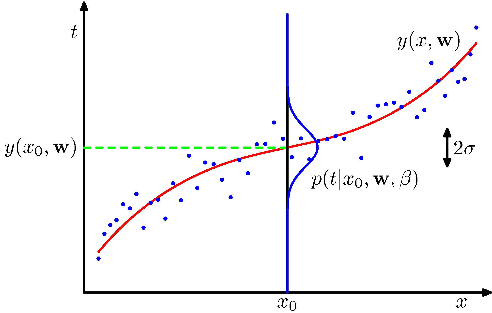

我们已经知道怎么把多项式拟合问题表示为误差最小化问题。现在我们回到曲线拟合的例子，并以概率的角度来看待，以及让我们完全从贝叶斯的角度来看待这个问题，从而更深刻地认识误差函数和正则化。    

曲线拟合问题的目标是能够根据$$ N $$个输入$$ X = (x_1,...,x_N)^T $$组成的数据集和它们对应的目标值$$ T = (t_1,...,t_N)^T $$，在给出新的输入变量$$ x $$的新值的情况下，预测目标变量$$ t $$。我们可以用目标变量值的概率分布来表示我们的不确定性。为了这个目标，我们可以假设，对于给定的$$ x $$的值，对应的目标变量$$ t $$是具有与公式(1.1)给出的多项式曲线$$ y(x, w) $$的值相等的均值的高斯分布，即：    

$$
p(t|x, w, \beta) = \mathcal{N}(t|y(x, w), \beta^{-1}) \tag{1.60}
$$

其中，为了和后续章节记号的一致性，我们定义的分布的方差的逆为精度（precision）参数$$ \beta $$。图1.16阐述了这种模式。

      
图 1.16: 目标值的高斯分布    

现在，使用训练数据$$ \{X, T\} $$，并通过最大似然来确定未知参数$$ w, \beta $$。假定数据从（1.60）分布中独立的取出，那么似然函数就等于：    

$$
p(T|X, w, \beta) = \prod\limits_{n=1}^{N}\mathcal{N}(t_n|y(x_n, w), \beta^{-1}) \tag{1.61}
$$    

与之前处理简单高斯分布时的做法一样，为了方便，把它转化为最大化似然函数的对数。代入（1.46）给出的高斯分布公式，可以得到似然函数的对数形式：    

$$
\ln p(T|X, w, \beta) = -\frac{\beta}{2}\sum\limits_{n=1}^{N}\{y(x_n, w) - t_n\}^2 + \frac{N}{2}\ln{\beta} - \frac{N}{2}\ln{(2\pi)} \tag{1.62}
$$

首先考虑确定多项式系数的最大似然解，记作$$ w_{ML} $$。它们是由对（1.62）关于$$ w $$的最大化来确定的。为了达到这个目的，可以先省略式（1.62）右手边的最后两项，因为它们与$$ w $$无关。并且，使用一个正系数来缩放似然函数的对数并不会改变它关于$$ w $$的最大值的位置，所以我们可以使用 1/2来代替$$ \beta/2
$$。最后，等价地去最小化似然函数的负对数，来替代最大化似然函数的对数。于是得到，对于确定$$ w $$的最大化似然等价于（1.2）中给出的最小化平方和误差函数。所以，平方和误差函数是采用高斯噪声的最大似然的自然结果。    

同样，可以使用最大似然来确定高斯条件分布的精度参数$$ \beta $$。关于$$ \beta $$来最大化公式（1.62）得到：    

$$
\frac{1}{\beta_{ML}} = \frac{1}{N}\sum\limits_{n=1}^{N}\{y(x_x, w_{ML}) - t_n\}^2 \tag{1.63}
$$    

再次提醒，和简单的高斯分布情况一样，首先确定控制均值的参数向量$$ w_{ML} $$，然后使用这个结果来确定精度$$ \beta_{ML} $$。    

当确定好参数$$ w, \beta $$后，就可以对新的值$$ x $$做预测。由于现在有了概率模型，所以可以使用一种称为预测分布（predictive distribution）来表达$$ t $$的概率分布，来代替一个简单的点估计。这是通过把最大似然参数代入式（1.60）得到的：    

$$
p(t|x, w_{ML}, \beta_{ML}) = \mathcal{N}(t|y(x, w_{ML}), \beta_{ML}^{-1}) \tag{1.64}
$$

现在让我们朝着贝叶斯的方法前进一步，在多项式系数$$ w $$上引入先验分布。简单起见，我们考虑高斯分布：    

$$
p(w|\alpha) = \mathcal{N}(w|0, \alpha^{-1}I) = (\frac{\alpha}{2\pi})^{(M + 1)/2}exp{-\frac{\alpha}{2}w^Tw} \tag{1.65}
$$    

其中$$ \alpha $$是分布的精度，$$ M + 1 $$是$$ M $$阶多项式的向量$$ w $$中元素个数。像$$ \alpha $$这样的控制分布的模型参数被称为超参数（hyperparameters）。使用贝叶斯定理，$$ w $$的后验分布，正比于先验分布和似然函数的乘积：

$$
p(w|X, T, \alpha, \beta) \propto  p(T|X, w, \beta)p(w|\alpha) \tag{1.66}
$$    

对于给定的数据集，可以通过找到最可能的$$ w $$值来确定$$ w $$，即最大化后验分布。这种技术叫做最大后验（maximum posterior）或简写为MAP。取公式(1.66)的负对数,结合公式(1.62)和 公式(1.65),我们可以看到,最大化后验概率就是最小化下式：

$$
\frac{\beta}{2}\sum\limits_{n=1}^{N}\{y(x_n, w) - t_n\}^2 + \frac{\alpha}{2}w^Tw \tag{1.67}
$$

因此，最大化后验概率等价于最小化正则化的平方和误差函数（之前在公式(1.4)中提到），正则化参数为$$ \lambda = \alpha / \beta $$。
