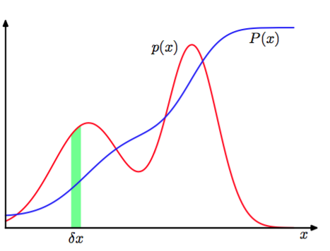

除了考虑离散事件的概率外，我们还希望考虑连续变量的概率。我们会把的讨论限制在一个相对非正式的形式上。如果一个实值变量$$ x $$落在区间$$ (x, x + \delta x) $$的概率由$$ p(x)\delta x$$给出，其中$$ \delta x \to 0 $$，那么我们就把$$ p(x) $$称作$$ x $$的概率密度（probability density）。图1.12阐释了这个概念。$$ x $$位于区间$$ (a, b) $$的概率由下式给出:    

$$
p(x \in (a, b)) = \int_a^b p(x) dx \tag{1.24}
$$

    
图 1.12: 连续变量的概率密度函数

因为概率是非负的，并且$$ x $$的值必须在实轴上，所以概率密度$$ p(x) $$必须满足这两个条件：

$$
\begin{eqnarray}
p(x) \leq 0 \tag{1.25} \\
\int_{-\infty}^{\infty} p(x) dx = 1 \tag{1.26}
\end{eqnarray}
$$  

在变量的非线性变化下，概率密度由一个简单的函数通过Jacobian因子变换得到。例如：一个变量 $$ x = g(y) $$，那么函数$$ f(x) $$ 就变成 $$ \widetilde{f}(y) = f(g(y)) $$。现在，考虑概率密度$$ p_x(x) $$，与它对应的关于新变量$$ y $$的密度$$ p_y(y) $$，其中不同的下标表示$$ p_x(x), p_y(y) $$ 是不同的两个密度函数。观测区间$$ (x, x + \delta x) $$变换为区间$$ (y, y + \delta y) $$，当$$ \delta x $$很小时，我们有$$ p_x(x)\delta x \simeq p_y(y)\delta y $$ 即：    

$$
p_y(y) = p_x(x)|\frac{dx}{dy}| = p_x(g(y))|g^\prime(y)| \tag{1.27}
$$  

这个性质的一个结果就是：概率密度的最大值取决于变量的选择。    

$$ x $$位于区间$$ (-\infty, z) $$的概率是由累计分布函数（cumulative distribution function）给出的：    
$$
P(z) = \int_{-infty}^z p(x)dx \tag{1.28}
$$

它就像图1.12那样满足$$ P^\prime(x) = p(x) $$。     

果我们有几个连续变量$$ x_1,...,x_D $$，一起被记作向量$$ x $$，那么我们就定义：联合概率密
度$$ p(x) = p(x_1,...,x_D) $$是使得落在包含点$$ x $$的无穷小体积$$ \delta x $$的点的概率等于$$ p(x)\delta x $$。多变量概率密度必须满足    

$$
\begin{eqnarray}
p(x) \leq 0 \tag{1.29} \\
\int p(x) dx = 1\tag{1.30}
\end{eqnarray}
$$  

其中积分必须包含整个$$ x $$空间。这也适用于离散变量和连续变量相结合的联合概率分布。     

注意：如果$$ x $$是离散变量，那么$$ p(x) $$就叫做概率质量函数（probability mass function），因为它可以被看做在合法的$$ x $$值上的“概率质量”的集合。

概率的加法，乘法规则以及贝叶斯定理，都适用于概率密度或离散变量与连续变量相结合的情形下。例如：$$ x,y $$是两个实值变量，它们的加法，乘法规则可以表示为如下形式：    
$$
\begin{eqnarray}
p(x) = \int p(x, y) dy \tag{1.31} \\ 
p(x, y) = p(y|x)p(x) \tag{1.32}
\end{eqnarray}
$$    

形式化地证明连续变量的加法，乘法规则（Feller, 1966）需要一个被叫做测度论（measure theory ）的数学分支，这超出的本书的范围。不过，它的正确性在直觉下是显然的。我们把实值变量分割为宽度为$$ \Delta $$，然后考虑这些离散的区间上的概率分布。当$$ \Delta \to 0 $$时，把求和转换为积分就得到希望的结果了。
