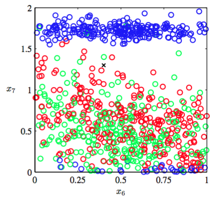
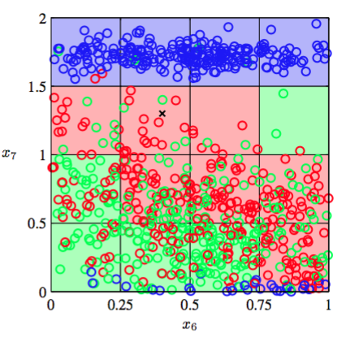
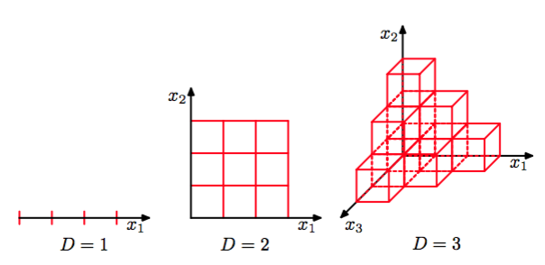
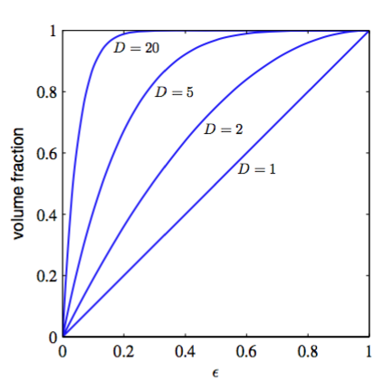
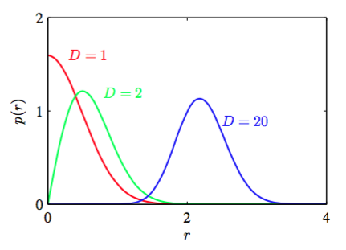

在多项式拟合的例子中，只有一个输入变量$$ x $$。在模式识别的实际运用中，我们不得不处理包含许多输入变量组成的高维空间。正如我们现在讨论的那样,这个问题是个很大的挑战,也是影响模式识别技术设计的重要因素。

为了阐述这个问题，我们考虑一个表示管道中石油、水、天然气各自所占的比例(Bishop and James, 1993)的数据集。这三种物质在管道都中有“均质（homogenous）”，“环状（annular）”，“层状（laminar）”这三种不同的几何形状，它们的比例也会变化。每 个数据点由度量了一窄束伽马射线穿过管道后强度的衰减度的12维向量构成。数据集详细描述见附录A。图1.19展示了其中100个数据点中$$ x_6, x_7
$$这两个度量的图像（为了方便说明，剩下的10个输入量被忽略）。每个数据点是根据它的几何形态来标记的，我们的目标是通过这个数据集的训练，来确定新的观测值$$ x_6, x_7
$$的类别，例如图1.19中用“叉”标记出来的点。

      
图 1.19: 石油流数据的输入变量x6和x7的散点图

我们看到这个“叉”被许多红色的点包围，所以我们假设这个点是属于红色类别的。然而，它附近也有很多绿色的点，所以我们也可能觉得它属于绿色类别。它似乎不太可能属于蓝色类别。这里的判断的直觉是“叉”这个点的类别应该更强的受到训练集中与它临近的点的影响，越远影响就越弱。事实上，这种判断方法是合理的，将会在后续章节中详细讨论。如何将这种直观的想法转换为学习算法呢？一种简单的方法是把输入空间切分成正规的单元格，如图1.20展示。当我们想预测一个测试点的类别，先确定它是属于哪个单元格的，然后找出所有落在这个单元格中的训练数据。测试点的类别就是它所在的单元格中数量最多的训练数据点的类别。    

      
图 1.20: 分类问题的一种简单的解法

这种朴素的方法有很多问题，但是当有很多输入变量（即高维输入空间）时，有一个问题变得尤为突出。问题来源如图1.21所示。

      
图 1.21: 维度灾难的例子

如果我们把输入空间分割成一个个的单元格，那么这些单元格的数量会随着空间的维数以指数的形式增大。当单元格以指数的形式增加时，为了保证单元格不为空就需要指数级的数据量。显然，我们不希望在稍微多点的变量空间上使用这种方法。所以需要一种更尖端的方法。    

让我们通过多项式曲线拟合的问题的结果来更深入的讨论高维空间问题，并把上面的方法扩展到有多个变量的输入空间的问题上。如果我们有D个输入变量，那三阶多项式就可以表示为：    

$$
y(x, w) = w_0 + \sum_{i=1}^Dw_ix_i + \sum_{i=1}^D\sum_{j=1}^Dw_{ij}x_ix_j + \sum_{i=1}^D\sum_{j=1}^D\sum_{k=1}^Dw_{ijk}x_ix_jx_k \tag{1.74}
$$

当D增加时，独立系数（因为变量x之间的互换对称性，不是所有系数都是独立的）的数量正比于$$ D^3 $$。实际情况中，为了知道数据间的复杂依赖关系，我们需要用到更高阶数的多项式。对于一个M阶的多项式，系数数量的增长速度类似于$$ D^M $$。虽然增长速度是一个幂函数，而不是指数函数，但是这仍然说明这种方法会迅速变得很笨重，因此在实际应用中很受限。     

我们从生活中获得的三维空间的直觉，在高维空间中会不起作用。举个简单的例子，一个D维空间中，半径为1的球。请问，位于半径$$ r = 1 − \epsilon $$和半径$$ r = 1 $$之间的部分占球的总体积的百分比是多少？我们知道，D维空间中半径为r的球的体积一定是$$ r^D $$的倍数，可以写成：

$$ V_D(r) = K_Dr^D \tag{1.75} $$

其中$$ K_D $$只依赖于D。所以我们得到比例：    

$$ \frac{V_D(1) - V_D(1-\epsilon)}{V_D(1)} = 1 - (1 - \epsilon)^D \tag{1.76} $$

图1.22给出了不同D值下,上式与$$ \ $$的关系。

      
图 1.22: 对于不同的D的比例

我们看到，对于较大的D，即使对于小的$$ \epsilon $$这个体积比依然趋近于1。因此，在高维空间中，一个球体的大部分体积都聚集在表面附近的薄球壳上。    

再举一个和模式识别直接相关的例子，考虑高维空间中的高斯分布。如果我们从笛卡尔坐标切换到极坐标，然后吧方向变量积分出来，获得一个关于距离原点的半径为r的概率密度的表达式$$ p(r) $$。因此$$ p(r)\delta r $$就是位于半径r处厚度为$$ \delta r $$的薄球壳内部的概率质量。对于不同的D值，这个概率分布的图像如图1.23所示。我们看到，对于大的D值，高斯分布的概率质量集中在薄球壳处。    

      
图 1.23: 不同的维度D中的高斯分布的概率密度关于半径r的关系。在高维空间中，高斯分布的大部分概率质量位于某个半径上的一个薄球壳上。

高维空间产生的这种严重的困难被称为维度灾难（curse of dimensionality ）（Bellman, 1961）。在这本书中，为了更容易地通过图形展示出所要说明的问题，我们会广泛的使用一，二维的例子来阐述。但是，读者需要注意不是所有在低维空间的直觉都适用于高维空间。    

尽管，维度灾难是模式识别中的一个非常重要的问题，但它不能阻止我们在高维空间中寻找有效的解决方法。这个原因是双重的。首先，真实的数据经常被限制在有着较低的有效维度的空间区域中，特别的，在目标值发生重要变化的方向上可能尤其受限。第二，真实数据通常比较光滑（至少局部上如此）,因此大多数情况下，输入变量的微小变化，目标值的变化也很小，所以我们可以采用局部的类似于插值的技术来对新的输入变量进行预测。成功的模式识别技术利用上述的一个或多个性质。举个例子，判断照相机拍摄的了传送带上的相同的平面物体的方向的应用。每一个数据是由图像中的像素点的个数决定维度的高维空间中的一个点。由于物体会以不用的方向出现在图片的不同位置，因此图像之间有3个自由度。一组图像将会处在高维空间的一个三维流形中。由于物体的位置，方向与像素灰度值的关系很复杂，所以流形是高度非线性的。如果目标是以图像作为输入，输出与位置无关的物体的方向，那么这时候流形只有一个很有意义的自由度。
