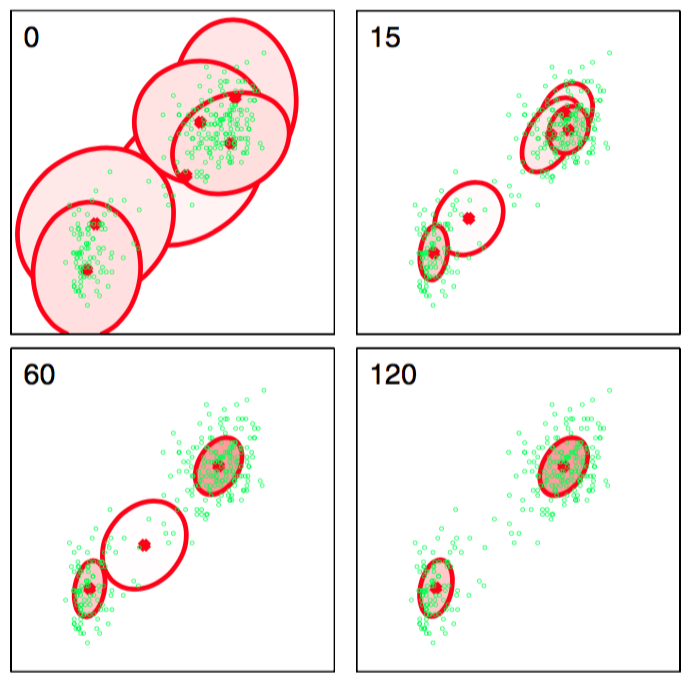

为了形式化地描述这个模型的变分方法，我们接下来写出所有随机变量的联合概率分布，形式为    

$$
p(X,Z,\pi,\mu,\Lambda) = p(X|Z,\Lambda)p(Z|\pi)p(\pi)p(\mu|\Lambda)p(\Lambda) \tag{10.41}
$$    

其中，各种因子已经在之前定义过。读者现在应该验证一下这种分解方式确实对应于图10.5给出的概率图模型。注意，只有变量$$ X = \{x_1,...,x_N\} $$是观测变量。    

我们现在考虑一个变分分布，它可以在潜在变量与参数之间进行分解，即    

$$
q(Z,\pi,\mu,\Lambda) = q(Z)q(\pi,\mu,\Lambda) \tag{10.42}
$$     

需要注意的是，为了让我们的贝叶斯混合模型能够有一个合理的可以计算的解，这是我们需要做出的唯一的假设。特别的，因子$$ q(Z) $$和$$ q(\pi, \mu, \Lambda) $$的函数形式会在变分分布的最优化过程中自动确定。注意，我们省略了$$ q $$分布的下标，就像我们在式（10.41）中做的那样。我们依赖参数来区分不同的分布。      

通过使用一般的结果（10.9），这些因子的对应的顺序更新方程可以很容易地推导出来。让我们考虑因子$$ q(Z) $$的更新方程的推导。最优因子的对数为     

$$
\ln q^*(Z) = \mathbb{E}_{\pi,\mu,\Lambda}[\ln p(X,Z,\pi,\mu,\Lambda)] + const \tag{10.43}
$$     

我们现在使用式（10.41）给出的分解方式。注意，我们只对等式右侧与变量$$ Z $$相关的函数关系感兴趣。因此，任何与变量$$ Z $$无关的项都可以被整合到可加的标准化系数中，从而有    

$$ 
\ln q^*(Z) = \mathbb{E}_\pi[\ln p(Z|\pi)] + \mathbb{E}_{\mu,\Lambda}[\ln p(X|Z, \mu, \Lambda)] + const \tag{10.44}
$$     

替换右手边的两个条件分布，然后再次把与$$ Z $$无关的项整合到可加性常数中，得到     

$$
\ln q^*(Z) = \sum\limits_{n=1}^N\sum\limits_{k=1}^Kz_{nk}\ln\rho_{nk} + const \tag{10.45}
$$     

其中我们定义了     

$$
\begin{eqnarray}
\ln\rho_{nk} = &\mathbb{E}&[\ln\pi_k] + \frac{1}{2}\mathbb{E}[\ln|\Lambda_k|] - \frac{D}{2}\ln(2\pi) \\
&-&\frac{1}{2}\mathbb{E}_{\mu_k,\Lambda_k}[(x_n - \mu_k)^T\Lambda_k(x_n - \mu_k)] \tag{10.46}
\end{eqnarray}
$$     

其中$$ D $$是数据变量$$ x $$的维度。式（10.45）两边取指数，得到     

$$
q^*(Z) = \prod\limits_{n=1}^N\prod\limits_{k=1}^Kr_{nk}^{z_{nk}} \tag{10.48}
$$     

其中     

$$
r_{nk} = \frac{\rho_{nk}}{\sum\limits_{j=1}^K\rho_{nj}} \tag{10.49}
$$     

我们看到，因子$$ q(Z) $$的最优解的函数形式与先验概率分布$$ p(Z|\pi) $$的函数形式相同。注意，由于$$ \rho_{nk} $$是一个实数值的指数，因此$$ r_{nk} $$是非负的，且和等于1，满足要求。     

对于离散分布$$ q^*(Z) $$，我们有标准的结果     

$$
\mathbb{E}[z_nk] = r_{nk} \tag{10.50}
$$    

从中我们看到$$ r_{nk} $$扮演着“责任”的角色。注意，$$ q^*(Z) $$的最优解依赖于关于其他变量计算得到的矩，因此同样的，变分更新方程是偶合的，必须用迭代的方式求解。    

现在，我们会发现定义观测数据关于“责任”的下面三个统计量会比较方便，即     

$$
\begin{eqnarray}
N_k &=& \sum\limits_{n=1}^Nr_{nk} \tag{10.51} \\
\bar{x}_k &=& \frac{1}{N_k}\sum\limits_{n=1}^Nr_{nk}x_n \tag{10.52} \\
S_k &=& \frac{1}{N_k}\sum\limits_{n=1}^Nr_{nk}(x_n - \bar{x}_k)(x_n -\bar{x}_k)^T \tag{10.53}
\end{eqnarray}
$$     

注意，这些类似于高斯混合模型的最大似然EM算法中计算的量。      

现在让我们考虑变分后验概率分布中的因子$$ q(\pi, \mu, \Lambda) $$。与之前一样，使用式（10.9）给出的一般的结果，得到     

$$
\begin{eqnarray}
\ln q^*(\pi,\mu,\Lambda) = & & \ln p(\pi) + \sum\limits_{k=1}^K\ln p(\mu_k,\Lambda_k) + \mathbb{E}_Z[\ln p(X|\pi)] \\
&+& \sum\limits_{k=1}^K\sum\limits_{n=1}^N\mathbb{E}[z_{nk}]\ln\mathcal{N}(x_n|\mu_k,\Lambda_k^{-1}) + const \tag{10.54}
\end{eqnarray}
$$     

我们观察到，这个表达式的右侧分解成了若干项的和，一些项只与$$ \pi $$相关，一些项只与$$ \mu, \Lambda $$相关，这表明变分后验概率$$ q(\pi,\mu,\Lambda) $$可以分解为$$ q(\pi)q(\mu,\Lambda) $$。此外，与$$ \mu, \Lambda $$相关的项本身由$$ k $$个与$$ \mu_k $$和$$ \Lambda_k $$相关的项有关，因此可以进一步分解，即     

$$
q(\pi,\mu,\Lambda) = q(\pi)\prod\limits_{k=1}^Kq(\mu_k,\Lambda_k) \tag{10.55}
$$     

分离出式（10.54）右侧的与$$ \pi $$相关的项，我们有     

$$
\ln q^*(\pi) = (\alpha_0 - 1)\sum\limits_{k=1}^K\ln\pi_k + \sum\limits_{k=1}^K\sum\limits_{n=1}^Nr_{nk}\ln\pi_k + const \tag{10.56}
$$     

其中我们使用了式（10.50）。两边取指数，我们将$$ q^*(\pi) $$看成狄利克雷分布    

$$
q^*(\pi) = Dir(\pi|\alpha) \tag{10.57}
$$     

其中$$ \alpha $$的元素为$$ \alpha_k $$，形式为     

$$
\alpha_k = \alpha_0 + N_k \tag{10.58}
$$     

最后，变分后验概率分布$$ q^*(\mu_k, \Lambda_k) $$无法分解成边缘概率分布的乘积，但是我们总可以使用概率的乘积规则，将其写成$$ q^*(\mu_k, \Lambda_k) = q^*(\mu_k | \Lambda_k)q^*(\Lambda_k) $$。两个因子可以通过观察式（10.54）得到，且可以读出$$ \mu_k, \Lambda_k $$。与预期相符，结果是一个高斯-Wishart分布，形式为      

$$
q^*(\mu_k,\Lambda_k) = \mathcal{N}(\mu_k|m_k,(\beta_k\Lambda_k)^{-1})W(\Lambda_k|W_k,v_k) \tag{10.59}
$$     

其中我们已经定义了    

$$
\begin{eqnarray}
\beta_k &=& \beta_0 + N_k \tag{10.60} \\
m_k &=& \frac{1}{\beta_k}(beta_0m_0 + N_k\bar{x}_k) \tag{10.61} \\
W_k^{-1} &=& W_0^{-1} + N_kS_k + \frac{\beta_0N_k}{\beta_0 + N_k}(\bar{x}_k - m_0)(\bar{x}_k - m_0)^T \tag{10.62} \\
v_k &=& v_0 + N_k \tag{10.63}
\end{eqnarray}
$$    

更新方程类似于混合高斯模型的最大似然解的EM算法的M步骤的方程。我们看到，为了更新模型参数上的变分后验概率分布，必须进行的计算涉及到的在数据集上的求和操作与最大似然方法中的求和操作相同。     

为了进行这个变分M步骤，我们需要得到表示“责任”的期望$$ E[z_{nk}] = r_{nk} $$。这些可以通过对式（10.46）给出的$$ ρ\rho_{nk} $$进行标准化的方式得到。我们看到，这个表达式涉及到关于变分分布的参数求期望，这些期望很容易求出，从而可得     
$$
\begin{eqnarray}
\mathbb{E}_{\mu_k,\Lambda_k}[(x_n - \mu_k)^T\Lambda_k(x_n - \mu_k)] &=& D\beta_k^{-1} + v_k(x_n - m_k)^TW_k(x_n - m_k) \tag{10.64} \\
\ln\tilde{\Lambda}_k \equiv \mathbb{E}[\ln|\Lambda_k|] &=& \sum\limits_{i=1}^D\psi\left(\frac{v_k + 1 -i}{2}\right) + D\ln 2 + \ln| W_k | \tag{10.65} \\
\ln\tilde{\pi}_k \equiv \mathbb{E}[\ln\pi_k] &=& \psi(\alpha_k) - \psi(\hat{\alpha}) \tag{10.66}
\end{eqnarray}
$$    

其中我们引入了$$ \tilde{\Lambda}_k $$和$$ \tilde{\pi}_k $$的定义，$$ \psi(\dot) $$是式（B.25）定义的Digamma函数，$$ \alpha = \sum_k\alpha_k $$。式（10.65）和式（10.66）是从Wishart分布和狄利克雷分布的标准性质中得到的。     

如果我们将式（10.64）、（10.65）和（10.66）代入式（10.46），然后使用式（10.49），我们得到了下面的“责任”的结果     

$$
r_{nk} \propto \tilde{\pi}_k\tilde{\Lambda}_k^{1/2}exp\left\{-\frac{D}{2\beta_k} - \frac{v_k}{2}(x_n - m_k)^T(x_n - m_k)\right\} \tag{10.67}
$$     

注意这个结果与最大似然EM算法得到的“责任”的对应结果的相似性，后者根据式（9.13）可以写成     

$$
r_{nk} \propto \pi_k|\Lambda_k|^{1/2}exp\left\{-\frac{1}{2}(x_n - \mu_k)^T(x_n - \mu_k)\right\} \tag{10.68}
$$     

其中我们使用精度代替了协方差，来强调它与式（10.67）之间的相似性。     

因此变分后验概率分布的最优化涉及到在两个阶段之间进行循环，这两个阶段类似于最大似然EM算法的E步骤和M步骤。在变分推断的与E步骤等价的步骤中，我们使用当前状态下模型参数上的概率分布来计算公式（10.64）、（10.65）和（10.66）中的各阶矩，从而计算$$ \mathbb{E}[z_{nk}] = r_{nk} $$。然后，在接下来的与M步骤等价的步骤中，我们令这些“责任”保持不变，然后使用它们通过公式（10.57）和（10.59）重新计算参数上的变分分布。在任何一种情形下，我们看到变分后验概率的形式与联合概率分布（10.41）中对应因子的函数形式相同。这是一个一般的结果，是由于选择了共轭先验所造成的。    

图10.6给出了将这种方法应用于老忠实间歇喷泉数据集上的结果。使用的模型是高斯混合模型，有$$ K = 6 $$个分量。我们看到，在收敛之后，只有两个分量的混合系数的期望值可以与它们的先验值区分开。这种效果可以根据贝叶斯模型中数据拟合与模型复杂度之间的折中来定性的理解。这种模型中的复杂度惩罚的来源是参数被推离了它们的先验值。对于解释数据点没有作用的分量满足$$ r_{nk} \simeq 0 $$，从而$$ N_k \simeq 0 $$。根据公式（10.58），我们看到$$ \alpha_k \simeq \alpha_0
$$。根据式（10.60）至（10.63），我们看到其他的参数回到了它们的先验值。原则上，这些分量会微小的适应于数据点，但是对于一大类先验分布来说，这种微小的调整的效果太小了，以至于无法在数值上看出来。对于高斯混合模型，后验概率分布中的混合系数的期望值为     

$$
\mathbb{E}[\pi_k] = \frac{\alpha_0 + N_k}{K\alpha_0 + N} \tag{10.69}
$$     

考虑一个分量其中$$ N_k \simeq 0 $$且$$ \alpha_k \simeq \alpha_0 $$。如果先验概率分布很宽，从而$$ \alpha_0 \to 0 $$，那么$$ \mathbb{E}[\pi_k] \to 0 $$，分量对模型不起作用。而如果先验概率与混合系数密切相关，即$$ \alpha_0 \to \infty $$，那在图10.6中，混合系数上的先验概率分布是一个狄利克雷分布，形式为（10.39）。回忆一 下，根据图2.5，对于$$ \alpha_0 < 1 $$，先验概率分布倾向于选择某些混合系数趋近于零的解。     

      
图 10.6 $$ K = 6 $$个高斯分布的变分贝叶斯混合，应用于老忠实间歇喷泉数据集，其中椭圆表示每个分量的概率密度的一个标准差位置的轮廓线，每个椭圆内部的红点对应于每个分量的混合系数的均值。每张图中左上角的数字表示变分推断迭代的次数。混合系数的期望在数值上与零无法区分的分量没有画出。    

图10.6是使用$$ \alpha_0 = 10^{−3}
$$得到的结果，产生了两个混合系数非零的分量。如果我们选择$$ \alpha_0 = 1 $$，那么我们得到三个混合系数非零的分量，对于$$ \alpha = 10 $$，所有六个分量的混合系数都不等于0。    

正如我们已经看到的那样，高斯分布的贝叶斯混合的变分解与最大似然的EM算法的解很 相似。事实上，如果我们考虑$$ N \to \infty
$$的极限情况，那么贝叶斯方法就收敛于最大似然方法的EM解。对于不是特别小的数据集来说，高斯混合模型的变分算法的主要的计算代价来自于“责任”的计算，以及加权数据协方差矩阵的计算与求逆。这些计算与最大似然EM算法中产生的计算相对应，因此使用这种贝叶斯方法几乎没有更多的计算代价。然而，这种方法有一些重要的优点。首先，在最大似然方法中，当一个高斯分量“退化”到一个具体的数据点时，会产生奇异性，而这种奇异性在贝叶斯方法中不存在。实际上，如果我们简单地引入一个先验分布，
然后使用MAP估计而不是最大似然估计，这种奇异性就会被消除。此外，当我们在混合分布中将混合分量的数量$$ K $$选得较大时，不会出现过拟合问题，正如我们在图10.6中看到的那样。最后，变分方法使得我们可以在确定混合分布中分量的最优数量时不必借助于交叉验证的技术。
