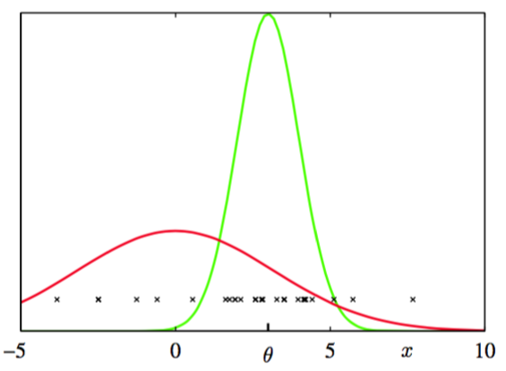
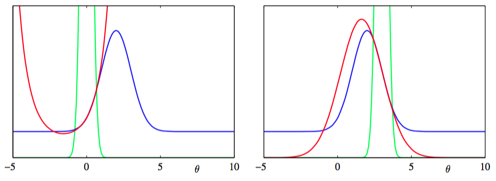
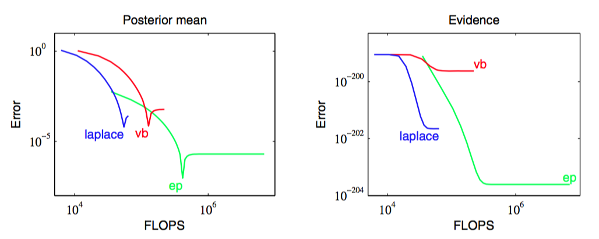

遵从Minka(2001b)的做法，我们使用一个简单的例子来说明EP算法，其中我们的目标是在给定服从那个分布的一组观测的情况下，推断变量$$ x $$上的多元高斯分布的均值$$ \theta $$。为了让问题更加有趣，观测位于一个背景杂波中，它本身也是一个高斯分布，如图10.15所示。    

      
图 10.15 维度为$$ D = 1 $$的数据空间中的聚类问题的说明。训练数据点（用叉号表示），从两个高斯分布混合而成的分布中抽出，高斯分量用红色和蓝色表示。我们的目标是从观测数据中推断绿色高斯分布的均值。

于是，观测值$$ x $$的概率分布是一个混合高斯分布，形式为    

$$
p(x|\theta) = (1 - w)\mathcal{N}(x|\theta,I) + w\mathcal{N}(x|0,aI) \tag{10.209}
$$    

其中，$$ w $$是背景杂波的比重，假设是已知的。$$ \theta $$上的先验概率分布是高斯分布，形式为    

$$
p(\theta) = \mathcal{M}(\theta|0,bI) \tag{10.210}
$$    

Minka(2001a)选择参数的值为$$ a = 10,b = 100,w = 0.5 $$。$$ N $$次观测$$ D = \{x_1,...,x_N\} $$和$$ \theta $$的联合概率分布为    

$$
p(D,\theta) = p(\theta)\prod\limits_{n=1}^Np(x_n|\theta) \tag{10.211}
$$    

因此后验概率分布由$$ 2^N $$个高斯分布混合而成。从而精确解决这个问题的计算代价会随着数据集的规模指数增长，因此对于大的$$ N $$值，精确求解是不可行的。    

为了将EP应用于杂波问题，我们首先看出，因子$$ f_0(\theta) = p(\theta) $$且$$ f_n(\theta) = p(x_n|\theta) $$。接下来，我们从指数族分布中选择一个近似分布。对于这个例子，比较方便的做法是选择一个球形高斯分布    

$$
q(\theta) = \mathcal{N}(\theta|m,vI) \tag{10.212}
$$    

于是，因子近似会取指数-二次函数的形式，即    

$$
\tilde{f}_n(\theta) = s_n\mathcal{N}(\theta|m_n,v_nI) \tag{10.213}
$$    

其中$$ n = 1,...,N $$，且令$$ \tilde{f}_0(\theta) $$等于先验概率分布$$ p(\theta) $$。注意，使用$$ \mathcal{N}(\theta|\dot,\dot) $$不表示右手边是一个良好定义的高斯概率密度（事实上，正如我们将看到的那样，方差参数$$ v_n $$可以为负），而是仅仅是一个方便的简化记号。近似$$ \tilde{f}_n(\theta),n = 1,...,N $$可以被初始化为1，对应于$$ s_n = (2\pi v_n)^{D /2} , v \to \infty $$以及$$ m_n = 0 $$，其中$$ D $$是$$ x $$的维度，因此也是$$ \theta
$$的维度。式（10.191）定义的初始的$$ q(\theta) $$因此就等于先验概率分布。     

我们接下来迭代的优化因子，方法是每次取一个因子$$ f_n(\theta) $$，然后使用式（10.205）、（10.206）和（10.207）。注意，我们不需要修改$$ f_0(\theta) $$，因为EP更新会让这一项保持不变。这里，我们给出结果，让读者自己来填充细节。     

$$
\begin{eqnarray}
m^{\\n} = m + v^{\\n}v_n^{−1}(m−m_n) \tag{10.214} \\
(v^{\\n})^{-1} = v^{-1} - v_n^{-1} \tag{10.215}
\end{eqnarray}
$$     

接下来，我们使用式（10.206）计算标准化常数，结果为     

$$
Z_n =(1−w)\mathcal{N}(x_n|m^{\\n},(v^{\\n} +1)I) + w\mathcal{N}(x_n|0,\alpha I) \tag{10.216}
$$

类似的，我们通过寻找$$ q^{\\n}(\theta)f_n(\theta) $$的均值，计算$$ q^{new}(\theta) $$的均值和方差，结果为    

$$
\begin{eqnarray}
m^{new} = m^{\\n} + \rho_n\frac{v^{\\n}}{v^{\\n} + 1}(x_n - m^{\\n}) \tag{10.217} \\
v^{new} = v^{\\n} - \rho_n\frac{(v^{\\n})^2}{v^{\\n} + 1} + \rho_n(1-\rho_n)\frac{(v^{\\n})^2\Vert x_n -m^{\\n}\Vert^2}{D(v^{\\n} +1)^2} \tag{10.218}
\end{eqnarray}
$$    

其中    

$$
\rho_n = 1 - \frac{w}{Z_n}\mathcal{N}(x_n|0,\alpha I) \tag{10.219}
$$

它可以简单的表示为点$$ x_n $$不在杂波中的概率。然后，我们使用式（10.207）计算优化因子$$ \tilde{f}(\theta) $$，它的参数为    

$$
\begin{eqnarray}
v_n^{-1} &=& (v^{new})^{-1} - (v^{\\n}^{-1} \tag{10.220} \\
m_n &=& m^{\\n} + (v_n + v^{\\n})(v^{\\n})^{-1}(m^{new} - m^{\\n}) \tag{10.221} \\
s_n &=& \frac{Z_n}{(2\pi v_n)^{D/2}\mathcal{N}(m_n|m^{\\n},(v_n + v^{\\n})I} \tag{10.222}
\end{eqnarray}
$$    

优化过程不断重复，直到满足一个合适的终止准则，例如在对所有因子进行的一次优化迭代中，参数值的最大改变量小于一个阈值。最后，我们使用式（10.208）来计算模型证据的近似，结果为     

$$
p(D) \simeq (2\pi v^{new})^{D/2}exp\left(\frac{D}{2}\right)\prod\limits_{n=1}^N\left\{s_n(2\pi v_n)^{-D/2}\right\} \tag{10.223} 
$$    

其中    

$$
B = \frac{(m^{new}^Tm^{new})}{v} - \sum\limits_{n=1}^N\frac{m_n^Tm_n}{v_n} \tag{10.224}
$$    

图10.16给出了对于一维参数空间$$ \theta $$的杂波问题的因子近似的例子。    

      
图 10.16 对于杂波问题的一维版本，具体因子的近似的例子。图中用蓝色表示$$ f_n(\theta) $$，用红色表示$$ \tilde{f}(\theta) $$，用绿色表示$$ q^{\\n}(\theta) $$。注意$$ q^{\\n}(\theta) $$现在的形式控制了$$ \theta $$的取值范围，在这个范围上，$$ \tilde{f}(\theta) $$是$$ f_n(\theta) $$的一个很好的近似。

注意，因子近似可以有无穷大的或者负数的“方差”参数$$ v_n $$。这仅仅对应于曲线向上弯曲而不是向下弯曲的情形，并且只要所有的近似后验概率$$ q(\theta) $$有正的方差，这种情形就未必有问题。图10.17对比了在杂波问题中，EP的表现、变分贝叶斯（平均场理论）的表现以及拉普拉斯近似的表现。

      
图 10.17 期望传播、变分推断和拉普拉斯近似在聚类问题上的对比。左图给出了预测后验概率分布的均值与浮点运算的数量的关系，右图给出了对应的模型证据的结果。
