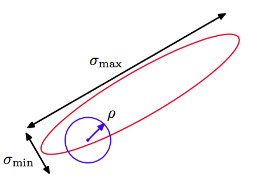

之前我们介绍了基本的Metropolis算法，没有实际演示它从所求的概率分布中采样的过程。在给出一个证明之前，我们首先讨论一个推广，被称为Metropolis-Hastings算法(Hastings，1970)，这种情形下，提议分布不再是参数的一个对称函数。特别地，在算法的步骤$$ \tau $$中，当前状态为$$ z(\tau) $$，我们从概率分布$$ q_k(z|z^{(\tau)}) $$中抽取一个样本$$ z^* $$，然后以概率$$ A_k(z^*，z^{(\tau)}) $$接受它， 其中    

$$
A_k(z^*，z^{(\tau)}) = \min\left(1, \frac{\tilde{p}(z^*)q_k(z^{(\tau)}|z^*)}{\tilde{p}(z^{(\tau)}q_k(z^*|z^{(\tau)}))}\right) \tag{11.44}
$$

这里，$$ k $$标记出可能的转移集合中的成员。与之前一样，接受准则的计算不需要知道概率分布$$ p(z) = \tilde{p}(z) / Z_p $$中的标准化常数$$ Z_p $$。对于一个对称的提议分布，Metropolis-Hastings准则（11.44）会简化为标准的Metropolis准则（11.33）。    

我们现在可以证明$$ p(z) $$对于由Metropolis-Hastings算法定义的马尔科夫链是一个不变的概率分布，方法是证明公式（11.40）定义的细节平衡是成立的。使用公式（11.44），得到    

$$
\begin{eqnarray}
p(z)q_k(z'|z)A_k(z',z) &=& \min(p(z)q_k(z'|z),p(z')q_k(z|z')) \\
&=& \min(p(z')q_k(z|z'),p(z)q_k(z'|z)) \\
&=& p(z')q_k(z|z')A_k(z,z') \tag{11.45}
\end{eqnarray}
$$

证明完毕。     

提议分布的具体的选择会对算法的表现产生重要的影响。对于连续状态空间来说，一个常见的选择是一个以当前状态为中心的高斯分布，这会在确定分布的方差参数时需要进行一个重要的折中。如果方差过小，那么接受的转移的比例会很高，但是遍历状态空间的形式是一个缓慢的随机游走过程，导致较长的时间开销。然而，如果方差过大，那么拒绝率会很高，因为在我们考虑的这种复杂问题中，许多的步骤会到达$$ p(z) $$很低的状态。考虑一个多元概率分布$$ p(z) $$，它在$$ z $$的元素之间具有很强的相关性，如图11.10所示。    

      
图 11.10 使用Metropolis-Hastings算法，用一个各项同性的高斯提议分布(蓝色圆圈)从一个具有相关性的多元高斯分布(红色椭圆)中采样，这个多元高斯分布在不同的方向上的标准差的数值相当不同。为 了让拒绝率较低，提议分布的标度$$ \rho $$应该与最小的标准差$$ \sigma_{min} $$处于同一个量级，这会产生随机游走的行为，达到独立的状态所需的步骤数的量级为$$ (\sigma_{max} /\sigma_{min})^2
$$，其中$$ \sigma_{max} $$是最大的标准差。

提议分布的标度$$ \rho $$应该尽可能大，同时要避免达到较高的拒绝率。这表明$$ \rho $$应该与最小的长度标度$$ \sigma_{min} $$是同一个量级的。然后，系统通过随机游走的方式探索伸长的方向，因此到达一个与原始状态或多或少独立的状态所需的步骤数量是$$ (\sigma_{max}/\sigma_{min})^2 $$量级的。事实上，在二维的情形下，随着$$ \rho
$$的增加，拒绝率的增加会被接收的转移步骤数的增加所抵消。更一般地，对于多元高斯分布，得到独立样本所需的步骤的数量的增长量级是$$ (\sigma_{max}/\sigma_2)^2 $$的，其中$$ \sigma_2是第二小的标准差(Neal， 1993)。抛开这些细节不谈，如果概率分布在不同的方向上的差异非常大，那么Metropolis-Hastings算法的收敛速度会非常慢。

