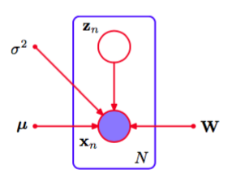

我们接下来考虑使用最大似然法确定模型的参数，给定观测数据点的数据点$$ X = \{x_n\} $$，概率PCA模型可以表示为一个有向图，如图12.10所示。    

      
图 12.10 对于观测变量$$ x $$的$$ N $$次观测组成的数据集，概率PCA模型可以表示为一个有向图，其中每个观测变量$$ x_n $$与潜在变量的$$ z_n $$的值相关联。 

根据式（12.35），对应的对数似然函数为    

$$
\begin{eqnarray}
\ln p(X|\mu,W,\sigma^2) &=& \sum\limies_{n=1}^N\ln p(x_n|W,\mu,\sigma^2) \\
&=& -\frac{ND}{2}\ln(2\pi) - \frac{N}{2}\ln |C| - \frac{1}{2}\sum\limits_{n=1}^N(x_n - \mu)^TC^{-1}(x_n - \mu) \tag{12.43}
\end{eqnarray}
$$

令似然函数关于$$ \mu $$的导数等于0，可以得到预期的结果$$ \mu = \bar{x} $$，其中$$ \bar{x} $$是式（12.1）定义的数据均值。代回到似然函数中得到

$$
\ln p(X|W,\mu,\sigma^2) = -\frac{N}{2}\{D\ln(2\pi) + \ln |C| + Tr(C^{-1}S)\} \tag{12.44}
$$    

其中$$ S $$是由式（12.3）定义的协方差矩阵。由于对数似然函数是$$ \mu $$的二次函数，因此解具有唯一的最大值，可以通过计算二阶导数的方式验证这一点。    

关于$$ W $$和$$ simga^2 $$的最大化更复杂，但是尽管这样，它们还是有一个近似的封闭解。Tipping and Bishop(1999b)证明，对数似然函数的所有驻点都可以写成     

$$
W_{ML} = U_M(L_M - \simga^2I)^{1/2}R \tag{12.45}
$$    

其中$$ U_M $$是一个$$ D \times M $$的矩阵，它的列由数据协方差矩阵$$ S $$的特征向量的任意（大小为$$ M $$的）子集给定。$$ M \times M $$的对角矩阵$$ L_M $$的元素是对应的特征值$$ \lambda_i $$，$$ R $$是一个任意的$$ M \times M $$的正交矩阵。    

此外，Tipping and Bishop(1999b)证明，当$$ M $$个特征向量被选为前$$ M $$个最大的特征值所对应的特征向量时，对数似然函数可以达到最大值，其他所有的解都是鞍点。类似的结果由Roweis(1998)独立地提出猜想，但是未给出证明。同样的，我们假定特征向量按照对应的特征值的大小降序排列，从而$$ M $$个主特征向量是$$ u_1,...,u_M $$。在这种情况下，$$ W $$的列定义了标准PCA的主子空间。这样，$$ \sigma^2 $$的对应的最大似然解为    

$$
\sigma_{ML}^2 = \frac{1}{D-M}\sum\limits_{i=M+1}^D\lambda_i \tag{12.46}
$$    

从而$$ \simga_{ML}^2 $$是与丢弃的维度相关联的平均方差。    

由于$$ R $$是正交的，因此它可以被看做是$$ M $$维潜在空间中的一个旋转矩阵。如果我们将$$ W $$的解代入到$$ C $$的表达式中，然后使用正交性质$$ RR^T = I $$，那么我们看到$$ C $$与$$ R $$无关。这表明，与之前讨论的一样，预测概率分布在潜在空间中具有旋转不变性。对于$$ R = I $$这一特定情形，我们看到$$ W $$的列是主成分特征向量，由方差参数的平方根$$ \sqrt{\lambda_i − \sigma^2
$$进行缩放。一旦我们认识到对于独立高斯分布（本例中的潜在空间分布和噪声模型）的卷积来说，方差是可加的，那么这些缩放因子的意义就很明显了。因此，在特征向量$$ u_i $$方向上的方差$$ \lambda_i $$由两部分相加得到，一部分来自于从单位方差潜在空间分布通过对应的$$ W $$的列向数据空间投影的贡献$$ \lambda_i − \sigma^2 $$，另一部分来自于在噪声模型的所有方向上相加的各项同性的方差的贡献$$ \sigma^2 $$。    

值得花一些时间研究一下式（12.36）给出的协方差矩阵的形式。考虑预测分布在由单位向量$$ v $$指定的方向上的方差，其中$$ v^Tv = 1 $$，这个方差为$$ v^TCv $$。首先假设$$ v $$与主子空间正交，即它等于被丢弃的特征向量的某个线性组合。那么$$ v^TU = 0 $$，因此v^TCv = \sigma^2 $$。所以模型预测了一个噪声方差正交于主子空间。根据公式(12.46)，这个方差就是丢弃的特征值的平均值。现在假设$$ v = u_i $$，其中$$ u_i $$是一个定义了主子空间的特征向量。那么$$ v^TCv =
(\lambda_i − \sigma^2) + \sigma^2 = \lambda_i $$。换句话说，这个模型正确地描述了数据沿着主轴方向的方差，并且用一个单一的均值$$ \sigma^2 $$近似了所有剩余方向上的方差。    

一种建立最大似然密度模型的方式是寻找数据协方差矩阵的特征值和特征向量，然后使用上面的结果计算$$ W $$和$$ \sigma^2 $$。在这种情况下，为了方便，我们会选择$$ R = I $$。然而，如果最大似然解通过对似然函数的数值最优化的方式得到，例如使用诸如共轭梯度法（Fletcher， 1987; Nocedal and Wright， 1999; Bishop and Nabney，2008）或EM算法，那么得到的$$ R $$值就可能是任意的了。 这表明$$ W
$$的列不必是正交的。如果我们需要一组正交的基，那么矩阵$$ W $$可以进行恰当的后处理（Golub and Van Loan， 1996）。此外，EM算法可以进行修改，直接产生单位正交的主方向，按照对应的特征值降序排序（Ahn and Oh， 2003）。    

潜在空间中的旋转不变性代表了一种形式的统计不可区分性，类似于我们在离散潜在变量的混合模型中遇到的情形。这里，有一组连续的参数会产生同样的预测密度，这不同于与混合模型中的分量重新标注相关联的离散不可区分性。    

如果我们考虑$$ M = D $$的情形，从而不存在维度的降低，那么$$ U_M = U $$且$$ L_M = L $$。使用正交的性质$$ UU^T = I $$以及$$ RR^T = I $$，我们看到$$ x $$的边缘概率分布的协方差$$ C $$变成了     

$$
C = U(L - \sigma^2I)^{1/2}RR^T(L - \sigma^2I)^{1/2}U^T + \sigma^2I = ULU^T = S \tag{12.47}
$$    

因此我们得到了无限制高斯分布的标准的最大似然解，其中协方差矩阵是样本的协方差。 传统的PCA通常的形式是$$ D $$维空间的数据点在$$ M $$维线性子空间上的投影。然而，概率PCA可以很自然地表示为从潜在空间到数据空间的映射，由式（12.33）给出。对于数据可视化和数据压缩之类的应用，我们可以使用贝叶斯定理将这个映射取逆。这样，任何在数据空间中的点$$ x $$都可以使用潜在空间中的后验均值和方差进行概括。根据式（12.42），均值为    

$$
\mathbb{E}[z|x] = M^{-1}W_{ML}^T(x-\bar{x}) \tag{12.48}
$$

其中$$ M $$由式（12.41）给出。它到数据空间的一个点的投影为    

$$
W\mathbb{E}[z|x] + \mu \tag{12.49}
$$    

注意，这与正则化的线性回归方程的形式相同，结果是最大化了线性高斯模型的对数似然函数。类似的，式（12.42）的后验协方差为$$ \sigma^2M^{−1}，与$$ x $$无关。    

如果我们取极限$$ \sigma^2 \to 0 $$，那么后验均值为    

$$
(W_{ML}^TW_{ML})^{-1}W_{ML}^T(x-\bar{x}) \tag{12.50}
$$     

这表示数据点在潜在空间上的正交投影，因此我们就恢复出了标准的PCA模型。然而在这种极限情况下，后验协方差是零，概率密度变得奇异。对于$$ \sigma^2 > 0 $$的情形，潜在投影与正交投影相比，会向原点方向偏移。    

最后，我们注意到，概率PCA模型在定义多元高斯分布时具有重要的作用，其中自由度的数量(即独立参数的数量)可以进行控制，同时仍然使得模型能够描述数据中的主要的相关关系。回忆一下，一个一般的高斯分布在协方差矩阵中有$$ D(D+1) / 2 $$个独立的参数（加上均值中的另外$$ D $$个参数）。因此参数的数量随着$$ D $$以二次函数的方式增多，从而在高位空间中变得无法处理。如果我们将协方差矩阵限制为对角化，那么它只有$$ D
$$个独立的参数，从而此时参数的数量随着维度线性增长。然而，现在它对变量的处理方式类似于将变量看成是独立的，从而无法表达变量之间的相关性关系。概率PCA提供了一种优雅的折中方式，它能够描述$$ M $$个最显著的相关性关系，同时使得参数的总数随着$$ D $$线性增长。我们可以通过计算概率PCA模型的自由度的数量来理解这一点，如下所述。协方差矩阵$$ C $$依赖于参数$$ W $$（大小为$$ D \times M $$）和$$ \sigma^2 $$，从而总的参数数量为$$ DM + 1
$$。然而，我们已经看到参数中存在一些与潜在空间坐标系的旋转相关联的冗余性。表示这种旋转的正交矩阵$$ R $$的大小为$$ M \times M $$。这个矩阵的第一列有$$ M − 1 $$个独立的参数，因为列向量必须归一化到单位长度，第二列有$$ M − 2 $$个独立的参数，因为列向量必须被标准化，并且必须与前一列垂直，以此类推。对这个算术序列求和，我们看到$$ R $$总共有$$ M(M −1) / 2 $$个独立参数。因此协方差矩阵$$ C $$的自由度的数量为    

$$
DM + 1 - \frac{M(M-1)}{2} \tag{12.51}
$$    

于是，对于固定的$$ M $$，这个模型中的独立参数的数量随着$$ D $$只是线性增长关系。如果我们令$$ M = D − 1 $$，那么我们就恢复出了高斯分布的完整的协方差矩阵的标准结果。在这种情况下，沿着$$ D − 1 $$个线性独立方向的方差由$$ W $$的列所控制，沿着剩余方向的方差由$$ \sigma^2 $$控制。如果$$ M = 0 $$，那么模型等价于各向同性协方差的情形。
