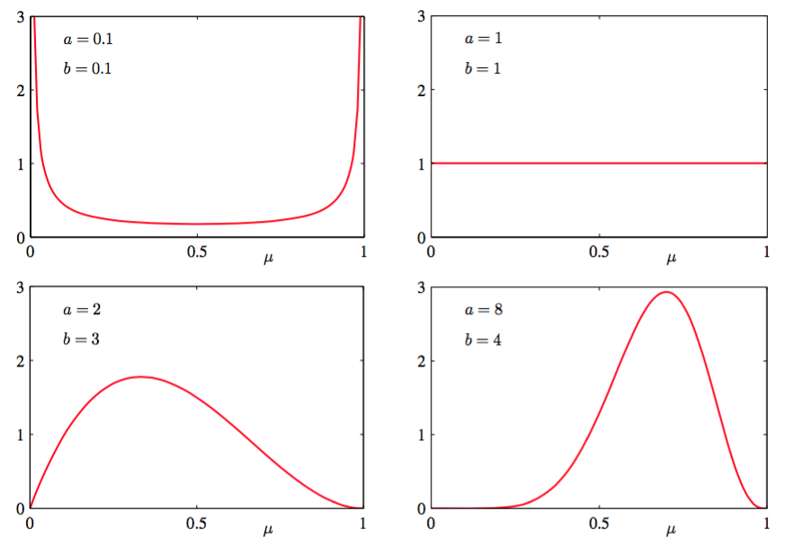

根据公式（2.8），可以得到伯努利分布中参数$$ \mu $$的最大似然解，因此在二项式分布中，最大似然解就是数据集中$$ x = 1 $$的观测所占的比例。正如我们之前提到的，对于小的数据集，这会发生非常严重过拟现象。为了以贝叶斯的观点来对待这样的问题，需要关于参数$$ \mu
$$的先验分布。这里，我们考虑一种形式简单但很有用的先验分布。为了得到这个先验，注意到似然函数是一个因子乘以$$ \mu^x(1-\mu)^{1-x} $$。如果选择一个正比于$$ \mu , (1-\mu) $$的先验，那么我们的后验就正比于先验和似然函数的乘积，且与先验分布具有相同的函数形式。这种性质被称为共轭（conjugacy），在本章的后面会看到几个这样的例子。因此，选择Beta分布为我们的先验分布：    

$$
Beta(\mu|a, b) = \frac{\Gamma(a + b)}{\Gamma(a)\Gamma(b)}\mu^{a-1}(1-\mu)^{b-1} \tag{2.13}
$$

其中
$$
\Gamma(x) \equiv \int_0^\infty u^{x-1}e^{-u}du 
$$

（2.13）中的系数保证beta分布是标准的，所以：

$$
\int_0^1 Beta(\mu|a,b)d\mu = 1 \tag{2.14}
$$

其中均值和方差：
$$
\begin{eqnarray}
\mathbb{E}[\mu] &=& \frac{a}{a + b} \tag{2.15} \\
var[\mu] &=& \frac{ab}{(a+b)^2(a+b+1)} \tag{2.16}
\end{eqnarray}
$$

由于$$ a,b $$控制了分布的参数$$ \mu $$，所以一般被称为超参数（hyperparameters）。图2.2展示了不同的超参数的beta分布。

      
图 2.2 beta分布

现在，把Beta先验（2.13）与二项似然函数（2.9）相乘再标准化就得到了$$ \mu $$的后验分布。只保留依赖$$ \mu $$的因子，得到后验分布的形式：

$$
p(\mu|m,l,a,b) \propto \mu^{m+a-1}(1-\mu)^{l+b-1} \tag{2.17}
$$

其中$$ l = N - m $$，即硬币例子中对应的反面朝上的数量。我们看到公式（2.17）依赖于$$ \mu $$的函数形式与先验分布相同，这反映了先验关于似然函数的共轭性质。事实上，这仅仅是另一种形式的Beta分布，对比公式（2.13）可以得到标准化系数：    

$$
p(\mu|m,l,a,b) = \frac{\Gamma(m+a+l+b)}{\Gamma(m+a)\Gamma(l+b)}\mu^{m+a-1}(1-\mu)^{l+b-1} \tag{2.18}
$$

从先验概率到后验概率，我们把数据集中$$ a $$个$$ x = 1 $$的观测值增加了$$ m $$，$$ b $$个$$ x = 0 $$的观测值增加了$$ l $$。这使我们可以简单地把先验概率中的超参数$$ a $$和$$ b $$分别解释为$$ x = 1, x = 0 $$的有效观测数（effective number of observation）。注意$$ a, b
$$不一定是整数。此外，如果接下来我们观测更多数据，那么就可以把后验分布当成先验分布。为了说明这一点，我们可以想象每次只取一个观测值，然后在每次观测之后乘以新观测值的似然函数，再标准化来更新当前的后验分布。在每个步骤中，后验是$$ x = 1, x = 0 $$的观测总数（先验的和实际的）$$ a,b $$的beta分布。新的$$ x = 1 $$的观测值对应的把$$ a $$的值增加1，而新的$$ x = 0 $$的观测值对应的把$$ b $$的值增加1。图2.3展示了其中一步。

      
图 2.3 贝叶斯顺序推断中的一个步骤

如果采用贝叶斯观点，这个顺序方法就自然产生了。这不依赖于先验或似然函数的选择，只取决于数据是否独立同分布的。顺序方法每次使用一个或一小批观测值，然后在使用下一观测值之前丢掉它们。这可以在一个稳定的数据流持续到达，模型必须在观测到所有数据之前就进行预测，这样的实时学习场景下使用。由于它不需要所有的数据都存储或加载到内存中，顺序方法在大数据中也非常有用。最大似然方法也可以转化成顺序框架。    

如果我们的目标是尽可能准确的预测下一次试验的输出，我们必须在给定观测数据集$$ D $$的情况下，评估$$ x $$的预测分布。根据概率的加法和乘法规则，可以得到：    

$$
p(x=1|D) = \int_0^1p(x=1|\mu)p(\mu|D)d\mu = \int_0^1\mu p(\mu|D)d\mu = \mathbb{E}[\mu|D] \tag{2.19}
$$

对后验分布$$ p(\mu|D) $$应用公式（2.18），beta分布的均值应用公式（2.15），得到：    

$$
p(x=1|D) = \frac{m+a}{m+a+l+b} \tag{2.20}
$$

这个结果可以简单地解释为对应于$$ x = 1 $$的观测结果（包括实际的观测值和假想的先验观测值）所占的比例。注意，在数据集无限大$$ m,l \to \infty $$的极限情况下，此时公式（2.20）的结果变成了最大似然的结果（2.8）。正如我们将看到的那样，贝叶斯的结果和最大似然的结果在数据集的规模趋于无穷的情况下会统一到一起。对于一个有限的数据集，$$ \mu
$$的后验均值，通常位于先验均值和公式（2.7）给出的$$ \mu $$的最大似然估计之间。     

根据图2.2得到，当观测数量增加时，后验分布的图像变得更尖了。这也可以从公式（2.16）中beta分布的方差得到，当$$ a \to \infty $$或$$ b \to \infty $$时方差趋向于0。事实上，我们可能想知道：随着我们观测到越来越多的数据，后验概率表示的不确定性将会持续下降。这个性质是贝叶斯学习的一个共有属性。    

为了证明这点，可以通过频率学观点来观察贝叶斯学习。一般来说这种性质确实成立。考虑一个观测数据集$$ D $$，参数为$$ \theta $$的贝叶斯推断问题，有联合分布$$ p(\theta, D) $$描述，结果：    

$$
\mathbb{E}_\theta[\theta] = \mathbb{E}_D[\mathbb{E}_\theta[\theta|D]] \tag{2.21}
$$
其中
$$
\begin{eqnarray}
\mathbb{E}_\theta[\theta] &\equiv& \int p(\theta)\theta d\theta \tag{2.22} \\
\mathbb{E}_D[\mathbb{E}_\theta[\theta|D]] &\equiv& \int\left\{\int\theta p(\theta|D)d\theta\right\}p(D)dD \tag{2.23}
\end{eqnarray}
$$

$$ \theta $$的后验均值（在产生数据集的分布上的平均）等于$$ \theta $$的先验均值。同样的我们可以得到：    

$$
var_\theta[\theta] = \mathbb{E}_D[var_\theta[\theta|D]] + var_D[\mathbb{E}_\theta[\theta|D]] \tag{2.24}
$$

公式（2.24）中左手边的项是$$ \theta $$的先验方差。右手边的第一项是$$ \theta $$的后验方差的均值。第二项是$$ \theta $$的后验均值的方差。因为方差是一个正的量，所以一般来说，$$ \theta $$的后验方差小于先验方差。后验均值的方差越大，这个差值的就越大。注意，这个结果只在通常情况下成立，对于特定的观测数据集，后验方差有可能大于先验方差。    

