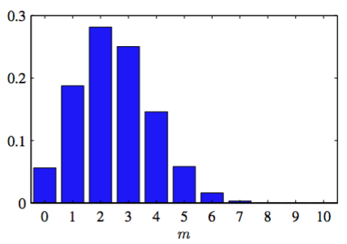

首先,我们考虑一个二元随机变量$$ x \in \{0, 1\} $$。例如，$$ x $$可能描述了扔硬币的结果，$$ x = 1 $$表 示“正面”，$$ x = 0 $$表示反面。我们可以假设由一个损坏的硬币，这枚硬币正面朝上的概率未必等于反面朝上的概率。$$ x = 1 $$的概率被记作参数$$ \mu $$：

$$
p(x = 1|\mu) = \mu \tag{2.1}
$$

其中$$ 0 \leq \mu \leq 1 $$，那么就得到$$ p(x=0|\mu) = 1 - \mu $$。$$ x $$的概率分布就可以写成：

$$
Bern(x|\mu) = \mu^x(1-\mu)^{1 - x} \tag{2.2}
$$

这叫做伯努利分布（Bernoulli distribution）。很容易验证这个分布是标准化的，它的均值和方差：

$$
\begin{eqnarray}
\mathbb{E}[x] = \mu \tag{2.3} \\
var[x] = \mu(1 - \mu) \tag{2.4}
\end{eqnarray}
$$

现在假设$$ x $$的观察数据集$$ D = \{x_1,...x_n\} $$。假设观测值是独立的从$$ p(x|\mu) $$中抽取，那么就可以构造关于$$ \mu $$的似然函数：

$$
p(D|\mu) = \prod\limits_{n=1}^Np(x_n|\mu) = \prod\limits_{n=1}^{N}\mu^{x_n}(1-\mu)^{1-x_n} \tag{2.5}
$$

在频率学的观点中，可以通过最大化似然函数来估计$$ \mu $$的值，或者等价地，最大化对数似然函数。在伯努利分布的情形下，对数似然函数为：    

$$
\ln p(D|\mu) = \sum\limits_{n=1}^N\ln p(x_n|\mu) = \sum\limits_{n=1}^N\{x_n\ln \mu + (1 - x_n)\ln(1-\mu)\} \tag{2.6}
$$

值得一提的是对数似然函数只通过$$ \sum_nx_n $$依赖于$$ N $$次观测值$$ x_n $$。这个和式是这个分布下数据的充分统计量（sufficient statistic），我们后面将详细研究充分统计量的重要作用。对$$ \ln p(D|\mu) $$关于$$ \mu $$微分并使它等于0，我们就得到最大似然估计：

$$
\mu_{ML} = \frac{1}{N}\sum\limits_{n=1}^N x_n \tag{2.7}
$$

也被称为样本均值（sample mean）。如果我们把数据集里$$ x = 1 $$（正面朝上）的观测的数量记作$$ m $$，那么我们可以把公式（2.7）写成下面的形式：    

$$
\mu_{ML} = \frac{m}{N} \tag{2.8}
$$

在最大似然的框架中，数据集中正面朝上的比列就是它的的概率。    

现在，我们抛3次硬币，并观测到3次都是正面朝上，那么就有 $$ N = m = 3, \mu_{ML} = 1 $$。在这个例子中，最大似然会预测将来所有的观测都是正面朝上。常识告诉我们这是不合理的。事实上，这是最大似然过拟的一个极端例子。稍后会看到，通过引入$$ \mu $$的先验分布，我们会得到一个更合理的结论。    

我们可以计算出数据集大小为$$ N $$的具有$$ m $$个$$ x = 1 $$的观测值的概率分布。这被称为二项式分布（binomial distribution），根据公式（2.5）得到它正比于$$ \mu^m(1 - \mu)^{N - m} $$。为了得到标准化的系数，在$$ N $$次抛硬币的过程中，需要把所有出现正面的次数加起来得到$$ m $$，所以二项式分布可以写成：    

$$
Bin(m|N, \mu) = \binom{N}{m}\mu^m(1 - \mu)^{N - m} \tag{2.9}
$$

其中
$$
\binom{N}{m} \equiv \frac{N!}{(N - m)!m!} \tag{2.10}
$$

表示从$$ N $$个相同的物体中选出$$ m $$个的方式的次数。图2.1展示了当$$ N = 10, \mu = 0.25 $$时的二项式分布。

      
图 2.1 二项式分布    

二项式分布的均值和方差可以从练习1.10的结果：独立事件的均值的和等于和的均值、方差的和等于和的方差来获得。根据$$ m = x_1 + ... + x_N $$，且对于由公式（2.3）（2.4）给出的每个观测值的均值和方差，我们得到：    

$$
\begin{eqnarray}
\mathbb{E}[m] = \sum\limits_{m=0}^{N} m Bin(m|N, \mu) = N_{\mu} \tag{2.11} \\
var[m] \equiv \sum\limits_{m=0}^{N}(m - \mathbb{E}[m])^2Bin(m|N, \mu) = N_\mu(1-\mu) \tag{2.12}
\end{eqnarray}
$$

这些结果可以直接通过微积分来证明。
