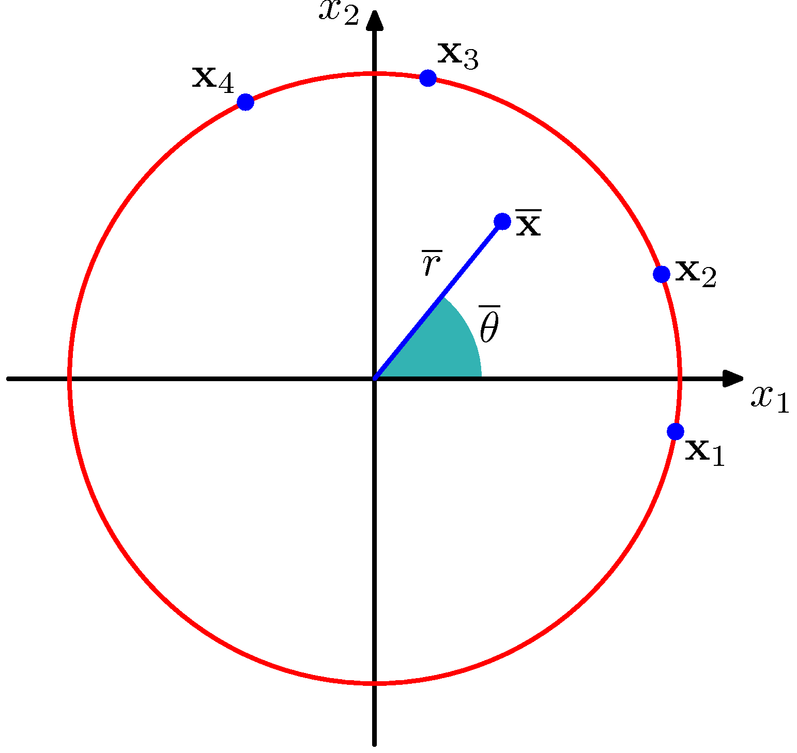
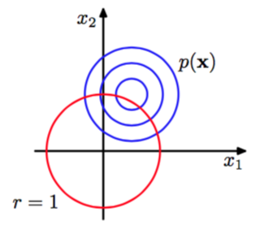
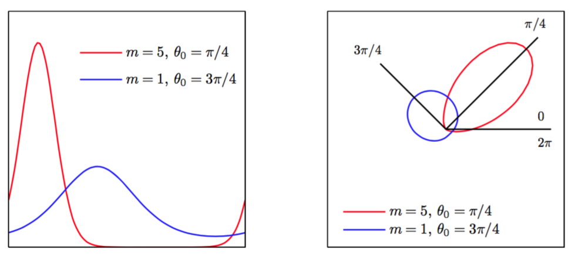
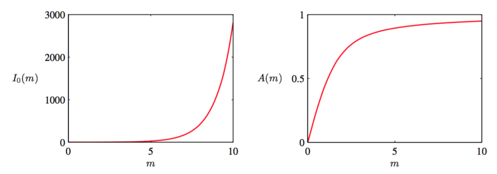
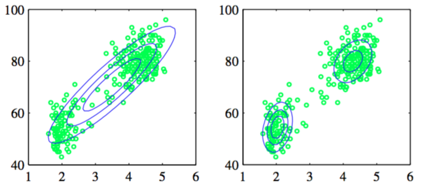

高斯分布无论是本身，还是它作为更复杂的概率模型的基石，它在实际应用中都非常重要，但是对于某些连续变量把它作为密度函数是不合适的。其中在实践中出现的一种重要的例子是周期变量。    

周期变量的一个例子是某个特定的地理位置的风向。实际中，我们可能测量许多天的风向值，然后希望通过一个参数分布来总结风向的规律。另一个例子是日历时间，其中我们可能感兴趣的是对周期为24小时或周期为一年的变量进行建模。这样的变量使用极坐标$$ 0 \leq θ < 2\pi $$表示更方便。    

我们可能选取一个方向作为原点，然后应用传统的概率分布（例如高斯分布）来处理这样的周期变量。但是，这种方法得出的结果会强烈依赖于原点的选择。例如，假设我们有两个观测，分别位是$$ \theta_1 = 1^{\circ}, \theta_2 = 359^{\circ} $$，然后我们使用标准一元高斯分布建模。如果把原点选择在$$ 0^{\circ} $$，那么这个数据集的样本均值为$$ 180^{\circ} $$，标准差在$$ 179^{\circ} $$。而如果把原点选择在$$ 180^{\circ} $$，那么均值为$$ 0^{\circ} $$，标准差为$$ 1^{\circ}
$$。显然，我们需要找到一种特殊的方法来处理周期变量。    

让我们考虑估计周期观测集合$$ D = \{\theta_1,...\theta_N\} $$的均值的问题。从现在开始，我们用$$ \theta $$表示弧度。我们已经看到，简单的平均值$$ (\theta_1+...+\theta_N)/N $$非常依赖于坐标系的选择。为了给均值找到一个不变的度量，我们发现观测可以被看做单位圆上的点。因此，可以用二维单位向量来$$ x_1,...x_N $$其中$$ \Vert{x_n}\Vert = 1, n = 1,...,N $$来描述，如图2.17所示。

      
图 2.17 周期变量

对向量$$ \{x_n\} $$求平均得到：

$$
\bar{x} = \frac{1}{N}\sum\limits_{n=1}^Nx_n \tag{2.167}
$$

然后求出这个平均值对应的弧度$$ \bar{\theta} $$。显然，这个定义保证均值的位置与极坐标原点选择无关。注意$$ \bar{x} $$通常在单位圆的内部。这些观测值在笛卡尔坐标系中表示为$$ x_n = (\cos \theta_n, \sin \theta_n) $$，样本均值在笛卡尔坐标系中表示为$$ \bar{x} = (\bar{r}\cos \bar{\theta},\bar{r}\sin \bar{\theta}) $$。代入(2.167)并同等看待$$ x_1, x_2 $$得到：    

$$
\bar{r}\cos \bar{\theta} = \frac{1}{N}\sum\limits_{n=1}^N\cos \theta_n , \bar{r}\sin \bar{\theta} = \frac{1}{N}\sum\limits_{n=1}^N\sin \theta_n \tag{2.168}
$$

求两者的比值，使用等式$$ tan\theta = \sin \theta / \cos \theta $$，得到$$ \bar{\theta} $$：    

$$
\bar{\theta} = tan^{-1}\left\{\frac{\sum_n\sin \theta_n}{\sum_n\cos \theta_n}\right\} \tag{2.169}
$$

很快，我们会看到，在周期变量上定义一个恰当的概率分布，最大似然估计很自然的得到这个结果。    

现在，我们考虑高斯分布的周期化推广：von Mises分布。这里我们把注意力集中在一元的分布，虽然周期分布可以在任意维的超球面上找到。关于周期分布的广泛讨论，可以参考Mardia and Jupp (2000)。    

按照惯例，考虑的周期概率分布$$ p(\theta) $$的周期为$$ 2\pi $$。任何一个定义在$$ \theta $$上的概率密度$$ p(\theta) $$不仅仅非负和积分等于1，而且有周期性的。因此，$$ p(\theta) $$一定满足下面三个条件：    

$$
\begin{eqnarray}
p(\theta) &\geq& 0 \tag{2.170} \\
\int_0^{2\pi}p(\theta)d\theta &=& 1 \tag{2.171} \\
p(\theta + 2\pi) &=& p(\theta) \tag{2.172}
\end{eqnarray}
$$

根据式（2.172），得到对于任意整数$$ M $$都有$$ p(\theta + M2\pi) = p(\theta) $$。     

可以很容易得到满足这三个条件的类高斯分布。考虑两个变量$$ x = (x_1, x_2) $$的具有均值$$ \mu = (\mu_1, \mu_2) $$和协方差矩阵为$$ \Sigma = \delta^2I $$的高斯分布（其中I是$$ 2 \times 2 $$的单位矩阵），所以：    

$$
p(x_1,x_2) = \frac{1}{2\pi\delta^2}exp\left\{-\frac{(x_1-\mu_1)^2 + (x_2-\mu_2)^2}{2\delta^2}\right\} \tag{2.173}
$$

$$ p(x) $$的等高线是园，如图2.18中展示。

      
图 2.18 

现在，考虑这个沿着一个固定半径的圆的分布的值，然后就能构造出没有被标准化周期分布。可以通过从笛卡尔坐标$$ (x_1, x_2) $$转化为极坐标$$ (r, \theta) $$的方式确定这个分布的形式，即：

$$
x_1 = r\cos \theta, x_2 = r\sin \theta \tag{2.174}
$$

同时，把$$ \mu $$映射到即坐标中：    

$$
\mu_1 = r_0\cos \theta_0 , \mu_2 = r_0\sin \theta_0 \tag{2.175}
$$

接下来，把这些变换代入二维高斯分布（2.173）中，并限制在单位圆$$ r = 1 $$上，注意，我们只对关于$$ \theta $$的相关性感兴趣。关注高斯分布的指数得到：    

$$
\begin{eqnarray}
&-&\frac{1}{2\delta^2}\{(r\cos \theta - r_0\cos \theta_0)^2 + (r\sin \theta - r_0\sin \theta_0)^2\} \\
& & = -\frac{1}{2\delta^2}\{1+r_0^2-2r_0\cos \theta \cos \theta_0 - 2r_0\sin \theta \sin \theta_0\} \\ 
& & = \frac{r_0}{\delta^2}\cos (\theta - \theta_0) + const \tag{2.176}
\end{eqnarray}
$$

其中“const”表示与$$ \theta $$无关的项，同时我们使用了下面的三角等式：    

$$
\begin{eqnarray}
\cos ^2A + \sin ^2 A &=& 1 \tag{2.177} \\
\cos A\cos B + \sin A\sin B &=& \cos (A-B) \tag{2.178}
\end{eqnarray}
$$

如果定义$$ m = r_0/\delta^2 $$，得到单位圆$$ r = 1 $$上分布$$ p(\theta) $$的最终表达式：    

$$
p(\theta|\theta_0,m) = \frac{1}{2\pi I_0(m)}exp\{m\cos (\theta-\theta_0)\} \tag{2.179}
$$

这就是von Mises分布，或环形正态分布（circular normal）。这里的$$ \theta_0 $$对应分布的均值，$$ m $$被称为浓度（concentration）参数，类似于高斯分布的方差的逆(精度)。式（2.179）中的标准化参数由$$ I_0(m) $$项表达，这是第一类零阶Bessel函数（Abramowitz and Stegun, 1965），由

$$
I_0(m) = \frac{1}{2\pi}\int_0^2\pi exp\{m\cos \theta\} d\theta \tag{2.180}
$$

定义。对于大的$$ m $$，这个分布接近于高斯分布。图2.19给出了von Mises分布的图像，图2.20给出了函数$$ I_0(m) $$的图像。

      
图 2.19 von Mises分布

      
图 2.20 Bessel函数

现在，考虑用最大似然来估计von Mises分布的参数$$ \theta_0,m $$。对数似然函数由：

$$
\ln p(D|\theta_0,m) = -N\ln(2\pi) - N\ln I_0(m) + m\sum\limits_{n=1}^N\cos (\theta_n - \theta_0) \tag{2.181}
$$

令其关于$$ \theta_0 $$的导数等于零，得到

$$
\sum\limits_{n=1}^N\sin (\theta_n - \theta_0) = 0 \tag{2.182}
$$

为了求得$$ \theta_0 $$，使用三角等式：    

$$
\sin (A-B) = \cos B\sin A - \cos A\sin B \tag{2.183}
$$

根据这些，得到

$$
\theta_0^{ML} = tan^{-1}\left\{\frac{\sum_n\sin \theta_n}{\sum_n\cos \theta_n}\right\} \tag{2.184}
$$

这是之前，把它看成二维笛卡尔空间的观测的均值的式（2.169）所得到的结果。    

类似的，关于$$ m $$最大化（2.181），且使用$$ I'_0(m) = I_1(m) $$（Abramowitz and Stegun, 1965）得到：    

$$
A(m) = \frac{1}{N}\sum\limits_{n=1}^N\cos (\theta_n-\theta_0^{ML}) \tag{2.185}
$$

其中我们已经用最大似然解$$ \theta_0^{ML} $$替换了对应的变量（我们正在关于$$ \theta, m $$进行联合最优化），我们定义：    

$$
A(m) = \frac{I_1(m)}{I_0(m)} \tag{2.186}
$$

函数$$ A(m) $$由图2.20展示

      
图 2.20 函数A(m)

使用式（2.178）给出的三角等式，可以吧式（2.185）写成：    

$$
A(m_{ML}) = \left(\frac{1}{N}\sum\limits_{n=1}^N\cos \theta_n\right)\cos \theta_0^{ML}-\left(\frac{1}{N}\sum\limits_{n=1}^N\sin \theta_n\right)\sin \theta_0^{ML} \tag{2.187}
$$

式（2.187）的右手边很容易求得，且函数$$ A(m) $$可以数值求逆。    

为了完整性，我们简要提一下其它构造周期概率分布的方法。最简单的方法是划分极坐标为固定大小区间在画出观测点的直方图。这种方法的有点是简单、灵活，但是也有极大的局限性。我们将在2.5节详细讨论直方图方法时看到这一点。另一种 方法与von Mises分布类似，都是从欧几里得空间的高斯分布开始，但是这个方法是在单位圆上求积分（边缘化），而不是把它当成概率的条件（Mardia and Jupp,
2000）。但是，这使得概率分布的形式更加复杂，因此我们不会更详细的讨论。最后一种方法是，在实数轴上的任何有效的分布(例如高斯分布)都可以通过把间隔为$$ 2\pi $$连续区间映射为周期变量$$ (0, 2\pi) $$，相当于把实数轴沿着单位圆进行包裹。与之前一样，得到的概率分布会比von Mises分布在计算上更加复杂。    

von Mises分布的一个局限性是它是单峰的。但是，通过将多个von Mises分布混合，就可以得到能对多个峰值的周期变量进行建模的灵活框架。Lawrence et al. (2002)给出了一个使用von Mises分布的机器学习的应用例子。关于回归问题中条件密度建模的更多信息，可以参考Bishop and Nabney(1996)。
