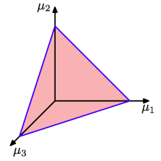
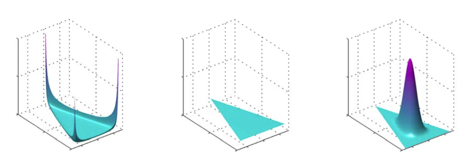

现在，我们介绍多项式分布参数$$ \{\mu_k\} $$的一组先验分布。观察多项式分布的公式，得到共轭先验：    
$$
p(\mu|\alpha) \propto \prod\limits_{k=1}^{K}\mu_k^{\alpha_k - 1}
$$

其中$$ 0 \leq \mu_k \leq 1 , \sum_k\mu_k = 1 $$，$$ (\alpha_1,...,\alpha_K)^T $$记作$$ mathbb{\alpha} $$是分布的参数。注意，由于总和的限制，$$ \{\mu_k\} $$空间上的分布被限制在$$ K − 1 $$维的单纯形（simplex）中。图2.4展示了$$ K = 3 $$的情形。

      
图 2.4 三个变量上的狄利克雷分布被限制在一个单纯形中

概率的标准形式为：

$$
Dir(\mu|\alpha) = \frac{\Gamma(\alpha_0)}{\Gamma(\alpha_1)...\Gamma(\alpha_K)}\prod\limits_{k=1}^K\mu_k^{\alpha_k - 1} \tag{2.38}
$$

这就是狄利克雷分布（Dirichlet distribution）。其中的$$ \Gamma(x) $$是1.141中定义的gamma函数，

$$
\alpha_0 = \sum\limits_{k=1}^K\alpha_k \tag{2.39}
$$

图2.5展示的不同的参数$$ \alpha_k $$的单纯形上的狄利克雷分布。

      
图 2.5 三个变量上的狄利克雷分布的图像，其中两个水平轴是单纯形平面上的坐标轴，垂直轴对应于概率密度的值。分布对应$$ \{\alpha_k\} = 0.1, \{\alpha_k\} = 1, \{\alpha_k\} = 10 $$。 

公式（2.38）的先验乘以公式（2.34）的似然函数，得到参数$$ \{\mu_k\} $$的后验分布公式：    

$$
p(\mu|D,\alpha) \propto p(D|\mu)p(\mu|D) \propto \prod\limits_{k=1}^K\mu_k^{\alpha_k + m_k - 1} \tag{2.40}
$$

我们看到后验分布还是狄利克雷分布，这说明，狄利克雷分布确实是多项式分布的共轭先验。这让我们能够通过与公式（2.38）比较，确定标准化参数。得到：

$$
\begin{eqnarray}
p(\mu|D, \alpha) &=& Dir(\mu|\alpha + m) \\
&=& \frac{\Gamma(\alpha_0 + N)}{\Gamma(\alpha_1+m_1)...+\Gamma(\alpha_K+m_K)}\prod\limits_{k=1}^K\mu_k^{\alpha_k + m_k - 1} \tag{2.41}
\end{eqnarray}
$$

其中$$ m = (m_1,...,_K)^T $$。与二项分布的beta先验一样，可以把狄利克雷分布参数$$ \alpha_k $$当成观测到$$ x_k = 1 $$的数量。    

注意，两个状态的量既可以用公式（2.9）的二项分布表示为二元变量，也可以用$$ K = 2 $$的公式（2.34）的多项式分布表示为“1-of-2”变量。   

