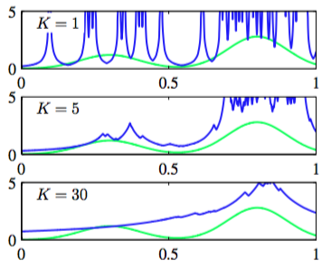
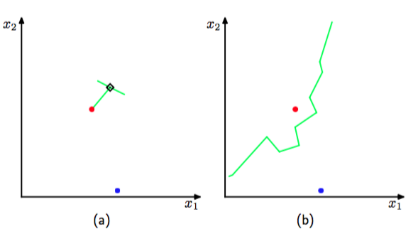
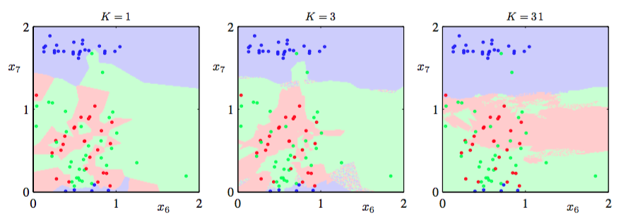

密度估计的核方法的一个问题是控制核宽度的参数$$ h $$对于所有核都是固定的。在高数据密度区域，大的$$ h $$值可能会导致过于平滑，且破坏了本应从数据中提取出的结构。但是，减小$$ h $$的值可能导致数据空间中低密度区域估计的噪声。所以$$ h $$的最优选择依赖于数据空间中的位置。这个问题可以由密度估计的近邻算法来解决。    

因此，回到局部密度估计的一般结果（2.246），与之前固定$$ V $$然后从数据中确定$$ K $$的值不同，我们考虑固定$$ K $$的值然后使用数据来确定合适的$$ V $$值。为了达到这个目的，考虑一个以点$$ x $$为中心的小球体，我们希望估计密度$$ p(x) $$，且允许球体的半径可以自由增，直到它精确地包含$$ K $$个数据点。概率密度$$ p(x) $$的估计就由式（2.246）给出，其中$$ V
$$等于得到的球体的体积。这就是K近邻算法。图2.26展示了与图2.24、2.25相同的数据集下不同的K的选择。

      
图 2.26 K近邻算法    

我们看到现在$$ K $$的值控制了光滑的程度，且与之前一样，$$ K $$的最优选择既不能太大也不能太小。注意，由于对所有空间的积分是发散的，所以K近邻算法产生的模型不是真正的密度模型。    

我们把密度估计的K近邻技术如何推广到分类问题作为本章的结束。为了达到这个目的，对每个独立的类别应用K近邻密度估计，然后在使用贝叶斯定理。假设有类别$$ C_k $$的数据点$$ N_k $$个，总共$$ N $$个点的数据集，即$$ \sum_kN_k = N $$。如果想确定新数据点$$ x $$的分类，那么我们画一个以$$ x $$为中心的，正好包含$$ K $$个不论属于哪个类别的数据点的球体。这样，式（2.246）为每个类别提供了密度估计：    

$$
p(x|C_k) = \frac{K_k}{N_kV} \tag{2.253}
$$

同样的，无条件概率密度为

$$
p(x) = \frac{K}{NV} \tag{2.254}
$$

其中类别的先验是由

$$
p(C_k) = \frac{N_k}{N} \tag{2.255}
$$

给出。现在使用贝叶斯定理将式（2.253）、（2.254）和（2.255）结合起来，得到类别的后验概率：    

$$
p(C_k|x) = \frac{p(x|C_k)p(C_k)}{p(x)} = \frac{K_k}{K} \tag{2.256}
$$

如果希望误分类的概率最小，那么可以把测试点$$ x $$分配给有着最大后验概率的类别，对应着最大的$$ K_k / K $$。因此为了给新的数据点分类，我们从训练数据中选择$$ K $$个最近的数据点，然后把新的数据点分配为这个集合中数量最多的点的类别。特例$$ K = 1 $$，因为简单地把测试点分类为训练数据集里距离最近的数据点的类别，所以被称为最近邻规则(nearest-neighbour rule)，。图2.27展示了这些概念。

      
图 2.27 K近邻分类    

在图2.28中，展示了第一章中介绍的石油流数据集在不同的$$ K $$值下的$$ K $$近邻算法的结果。如我们期望的那样,$$ K $$控制着光滑度，即小的$$ K $$值会使得每个类别有许多小区域，而大的$$ K $$值会产生数量较少面积较大的区域。

      
图 2.28 石油数据集的K近邻分类    

最近邻(K = 1)分类器的一个有趣的性质是在极限$$ N \to \infty $$的情况下，它的错误率不会超过最优分类器（即真实概率分布的分类器）可以达到的最小错误率的二倍（Cover and Hart, 1967）。    

正如到目前为止讨论的那样，K近邻方法和核密度估计方法都需要存储整个训练数据，这导致计算大数据集会非常昂贵。通过一次额外的计算来构造一个基于树的搜素结构，使得可以不遍历整个数据集高效地找到（近似）近邻，这种计算代价可以被抵消。尽管这样，这些非参数化方法然有很大的局限性。另一方面，我们已经看到，简单的参数化模型非常受只能表示某一种形式的概率分布的限制。因此我们需要寻找一种非常灵活概率密度模型，且它的复杂度可以被控制为与训练数 据的规模无关。在后续章节中将会看到如何找到这种概率密度模型。

