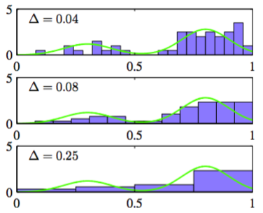

通过本章，我们关注了那些可以由数据集确定的控制参数的，具有特殊函数形式的概率分布。这被称为概率密度建模的参数化（parametric）方法。这种方法的一个严重的局限性是选择了一个对于生成数据来说可能是很差的概率密度模型，从而会导致相当差的预测表现。例如，如果生成的数据是多峰的，那么这样的特性不可能被单峰的高斯分布捕捉到。    

在这最后一节，我们考虑一些对概率分布的形式进行了很少的假设的密度估计的非参数化（nonparametric）方法。现在我们把注意力集中到简单的频率学家方法。但是，读者应该意识到非参数化贝叶斯方法正在吸引越来越多的研究者的兴趣（Walker et al., 1999; Neal, 2000; Muler and Quintana, 2004; Teh et al., 2006）。    

让我们以在图1.11的边缘分布和条件分布，以及图2.6的中心极限定理中讨论过的密度估计的直方图方法作为开始。这里，更加详细地探索一元连续变量$$ x $$下的直方图密度估计的性质。标准的直方图简单地把$$ x $$划分成宽度为$$ \Delta_i $$的不同箱子，然后对落在第$$ i $$个箱子中的$$ x $$的观测数量$$ n_i
$$进行计数。为了把这种计数转换成标准化的概率密度，简单地把观测数量除以观测的总数$$ N $$，再除以箱子的宽度$$ \Delta_i $$，得到每个箱子的概率的值：    

$$
p_i = \frac{n_i}{N\Delta_i} \tag{2.241}
$$

从中显然可得$$ \int p(x)dx = 1 $$。这就给出了一个对于每个箱子的密度$$ p(x) $$是常数的模型，通常会选择相同宽度的箱子，即$$ \Delta_i = \Delta $$。    

图2.24展示了直方图密度估计。这些数据是从混合了两个高斯的绿色曲线的分布中取出。

      
图 2.24 直方图密度估计    

这展示了三种不同的箱子宽度$$ \Delta $$的选择的情况。我们看到当$$ \Delta $$非常小的时候（最上面的图）得到的密度模型是非常尖的，有很多结构没有出现在生成数据的概率分布中。相反，如果$$ \Delta $$过大（最下面的图），那么最终的概率模型会过于平滑，结果无法扑捉绿色曲线的双峰性质。当$$ \Delta $$取一个
中等大小的值时（中间的图），可以得到最好的结果。原则上，一个直方图概率密度模型也依赖于箱子边缘位置的选择，但是这对于结果的影响通常会小于$$ \Delta $$的值的选择。    

注意，直方图方法具有下面的性质（与我们将要讨论的分布不同）：一旦直方图被计算出来，数据本身就被丢弃了，这当数据量很大的时候会很有优势。且它也可以很容易的应用到数据顺序到达的情形。    

在实际应用中，直方图方法能快速地将一维或二维的数据可视化，但是并不适用于大多数概率密度估计的应用。一个很明显的问题是：因为箱子的边缘而不是生成数据的概率分布本身的性质造成的估计的概率密度具有不连续性。另一个主要的局限性是维数放大。如果我们把$$ D $$维空间的每一维的变量都划分到$$ M $$个箱子中，那么箱子的总数为$$ M^D $$。这种对于$$ D $$的指数放大是维度灾难的一个例子。在高维空间中，想对于局部概率密度进行有意义的估计，需要的数据量是不可接受的。    

但是，密度估计的直方图方法给我们上了重要的两课。第一，为了估计在某个特定位置的概率密度，需要考虑位于那个点的某个邻域内的数据点。注意，局部性的概念要求我们假设某种形式的距离度量，这里我们假设的是欧几里得距离。对于直方图，这种邻域的性质由箱子定义，且有一个自然的“平滑”参数描述局部区域的空间扩展，即这里的箱子宽度。

第二，为了获得好的结果，平滑参数的值既不能太大也不能太小。这让我们回忆起了第1章讨论过的多项式曲线拟合问题中对于模型复杂度的选择。那里是多项式的阶数$$ M $$或者正则化参数$$ \alpha $$，被优化成了某些中等大小的值，既不太大也不太小。有了这些认识，让我们讨论密度估计的两个广泛使用的非参数化方法：核估计以及近邻估计。与简单的直方图方法相比，这两种方法能更好的处理维度放大的情况。

