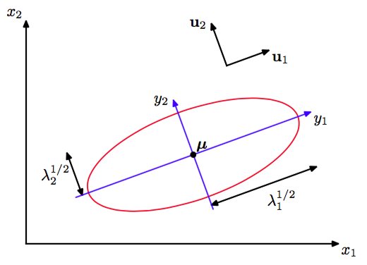
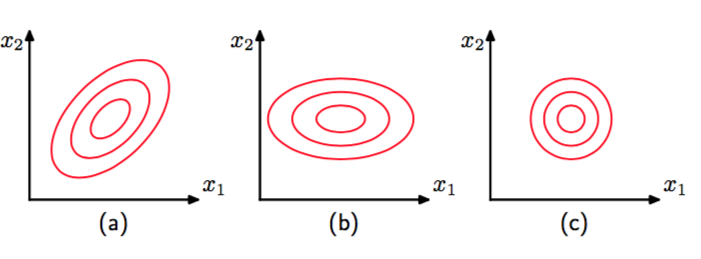

高斯也称为正态分布，是连续变量分布上广泛使用的一种模型。对于单变量$$ x $$，高斯分布可以写成：    

$$
\mathcal{N}(x|\mu, \delta^2) = \frac{1}{(2\pi\delta^2)^{1/2}}exp\left\{-\frac{1}{2\delta^2}(x-\mu)^2\right\} \tag{2.42}
$$

其中$$ \mu, \delta^2 $$分别为均值和方差。对于$$ D $$维向量$$ x $$，多变量的高斯分布形式为：    

$$
\mathcal{N}(x|\mu, \Sigma) = \frac{1}{(2\pi)^{D/2}}\frac{1}{|\Sigma|^{1/2}}exp{-\frac{1}{2}(x-\mu)^T\Sigma^{-1}(x-\mu)} \tag{2.43}
$$

其中$$ \mu $$为$$ D $$维均值向量，$$ \Sigma $$为$$ D \times D $$的协方差矩阵。$$ |\Sigma| $$是$$ \Sigma $$的行列式。

高斯分布会出现在许多不同的问题中，可以从多个不同的角度来理解。例如，我们已经证明，对于单个实值变量，使熵最大的是高斯分布。这个性质同样适用于多变量高斯。    

另一种情况是，多个随机变量之和也会产生高斯分布。中心极限定理（由拉普拉斯提出）告诉我们，温和的一组随机变量的和的概率分布随着项的增加，趋向于高斯分布（Walker, 1969）。为了阐述这个，考虑$$ N $$个区间[0, 1]上的均匀分布的随机变量$$ x_1,...,x_N $$，确定它们的均值$$ (x_1+...+x_n) / N $$的分布。如图2.6展示的，对于大的$$ N $$，趋向于高斯分布。

      
图 2.6 均匀分布的和的均值的直方图

在实际应用中，随着N的增加，分布会很快的收敛于高斯分布。由这个结论可得：式（2.9）定义的二元随机变量$$ x $$在$$ N $$次观测中出现$$ m $$次的二项分布将会在$$ N \to \infty $$时趋向于高斯分布（图2.1给出了$$ N = 10 $$的情形)。    

现在详细讨论高斯分布中的一些重要的分析性质。这就使得这节内容依赖于之前所介绍的技术，并且需要对各种矩阵性质比较熟悉。我们强烈鼓励读者能够使用这里介绍的技术熟练操作高斯分布，因为这对于理解后续章节中出现的更加复杂的模型非常有帮助。    

首先，考虑高斯分布的几何形式。高斯通过出现在指数位置上的

$$
\Delta^2 = (x-\mu)^T\Sigma^{-1}(x-\mu) \tag{2.44}
$$

这个二次型依赖于$$ x $$。$$ \Delta $$被称为$$ \mu $$到$$ x $$的马氏距离（ Mahalanobis distance），当$$ \Sigma $$是单位矩阵时，退化成欧式距离。当这个二次型在$$ x $$空间中是常数的时候，高斯分布的曲面也是常数。    

首先，我们注意到矩阵$$ \Sigma $$可以不失一般性的取为对称矩阵，因为任何非对称项都会从指数中消失。现在考虑，协方差矩阵的特征向量方程：

$$ \Sigma u_i = \lambda_iu_i \tag{2.45} $$

其中$$ i = 1,...,D $$。因为$$ \Sigma $$是实对称矩阵，所以它的特征值也是实数，特征向量可以从正交集中选择，得到：

$$ u_i^tu_j = I_{ij} \tag{2.46} $$

其中$$ I_{ij} $$是单位矩阵的第$$ i,j $$个元素，满足：

$$
I_{ij} = 
\begin{cases} 
1, if i=j \\
0, otherwise
\end{cases}  \tag{2.47}
$$

协方差矩阵$$ \Sigma $$可以表示成特征向量的展开的形式：

$$
\Sigma = \sum\limits_{i=1}^D\lambda_iu_iu_i^T \tag{2.48} 
$$

同样的协方差的逆矩阵$$ \Sigma^{-1} $$可以表示为

$$ 
\Sigma^{-1} = \sum\limits_{i=1}^D\frac{1}{\lambda_i}u_iu_i^T \tag{2.49}
$$

公式（2.49）代入（2.44），可以把二次型表示为：

$$
\Delta^2 = \sum\limits_{i=1}^D \frac{y_i^2}{\lambda_i} \tag{2.50}
$$

其中

$$
y_i = u_i^T(x - \mu) \tag{2.51}
$$
我们可以把$$ \{y_i\} $$解释为由正交向量$$ u_i $$关于原来的$$ x_i $$坐标系平移和旋转之后得到的新坐标系。记$$ y = (y_1,...,y_D)^T $$，可得：    

$$
y = U(x - \mu) \tag{2.52}
$$

其中$$ U $$是由行向量$$ u_i^T $$组成的。根据公式（2.46）可得$$ U $$是正交矩阵，即它满足$$ UU^T = I, U^TU = I $$,其中$$ I $$是单位矩阵。    

如果公式（2.51）是常数时，那么二次型和高斯密度在曲面上为常数。如果所有特征值$$ \lambda_i $$都是正的，那么这些曲面是中心位于$$ \mu $$，轴方向为$$ u_i $$，轴方向的缩放比例为$$ \lambda_i^{1/2} $$的椭球面，如图2.7所示。

      
图 2.7 椭球面

为了很好的定义高斯分布，需要协方差矩阵的特征值严格为正，不然分布就不能标准化。每一个特征值都严格为正的矩阵被称为正定的（positive definite）。在12章中，我们会遇到一个或者多个特征值为零的高斯分布，那种情况下分布是奇异的，被限制在低维的子空间中。每一个特征值都非负的矩阵被称为半正定的（positive semidefinite）。    

现在，在由$$ y_i $$定义的新坐标系中，高斯分布的形式。从$$ x $$坐标系转换到$$ y $$坐标系的Jacobian矩阵$$ J $$为：    

$$
J_{ij} = \frac{\partial x_i}{\partial y_j} = U_{ji} \tag{2.53}
$$

其中$$ U_{ji} $$是矩阵$$ U^T $$的元素。有矩阵$$ U $$的正交性，可得Jacobian矩阵的行列式的平方为：    

$$
|J|^2 = |U^T|^2 = |U^T||U| = |U^TU| = |I| = 1 \tag{2.54}
$$

由此可得$$ |J| = 1 $$。且协方差矩阵的行列式$$ |\Sigma| $$可以写成特征值的乘积：

$$
|\Sigma|^{1/2} = \prod\limits_{j=1}^D \lambda_j^{1/2} \tag{2.55}
$$

因此，在$$ y_j $$坐标系下，高斯分布由以下形式：    

$$
p(y) = p(x)|J| = \prod\limits_{j=1}^D\frac{1}{(2\pi\lambda_j)^{1/2}}exp\left\{-\frac{y_j^2}{2\lambda_j}\right\} \tag{2.56}
$$

这是$$ D $$个独立的一元高斯分布的乘积。特征向量定义了一系列平移，旋转变换，使联合概率分布转行为独立分布的乘积。分布关于$$ y $$坐标系的积分为：

$$
\int p(y)dy = \prod\limits_{j=1}^D\int_{-\infty}^\infty \frac{1}{(2\pi\lambda_j)^{1/2}}exp\left\{-\frac{y_j^2}{2\lambda_j}\right\}dy_j = 1 \tag{2.57}
$$

其中使用了公式（1.48）的结果来标准化一元高斯分布。多元高斯分布公式（2.43）必然是标准化的。    

现在，我们考察高斯分布的动差，并提供参数$$ \mu, \Sigma $$的解释。高斯分布的$$ x $$的期望是：    

$$
\begin{eqnarray}
\mathbb{E}[X] &=& \frac{1}{(2\pi)^{D/2}}\frac{1}{|\Sigma|^{1/2}}\int exp\left\{-\frac{1}{2}(X - \mu)^T\Sigma^{-1}(X - \mu)\right\}XdX \\
&=& \frac{1}{(2\pi)^{D/2}}\frac{1}{|\Sigma|^{1/2}}\int exp\left\{-\frac{1}{2}Z^T\Sigma^{-1}Z\right\}(Z+\mu)dZ  \tag{2.58}
\end{eqnarray}
$$

其中使用了$$ Z = X - \mu $$替换了变量。注意，指数函数是关于$$ Z $$的偶函数，且积分范围是$$ (-\infty, \infty) $$，根据对称性项$$ (Z + \mu) $$中的$$ Z $$可以消去。因此：

$$
\mathbb{E}[X] = \mu \tag{2.59}
$$

所以$$ \mu $$是高斯分布的均值。    

现在，考虑高斯分布的二阶动差。在一元的情况下，二阶动差由$$ \mathbb{E}[x^2] $$给出。对于多元高斯分布，有$$ D^2 $$个二阶动差，由$$ \mathbb{E}[x_ix_j] $$给出，组合在一起得到矩阵$$ \mathbb{E}[XX^T] $$。这个矩阵可以写成：    

$$ 
\begin{eqnarray}
\mathbb{E}[XX^T] &=& \frac{1}{(2\pi)^{D/2}}\frac{1}{|\Sigma|^{1/2}}\int exp\left\{-\frac{1}{2}(X - \mu)^T\Sigma^{-1}(X - \mu)\right\}XX^TdX \\
&=& \frac{1}{(2\pi)^{D/2}}\frac{1}{|\Sigma|^{1/2}}\int exp\left\{-\frac{1}{2}Z^T\Sigma^{-1}Z\right\}(Z+\mu)(Z+\mu)^TdZ \tag{-}
\end{eqnarray}
$$

在一次使用了$$ Z = X - \mu $$替换了变量。注意，交叉项$$ \mu Z^T, \mu^TZ $$由对称性再一次消去。项$$ \mu\mu^T $$是不变的，可以提取出来放到积分的外面。因为高斯分布是标准化的，所以它自己是等于单位矩阵。考虑涉及$$ ZZ^T $$的项。可以再次使用公式（2.45）给出的协方差矩阵的特征向量展开，和特征向量的完备性，得到：

$$
Z = \sum\limits_{j=1}^Dy_ju_j  \tag{2.60}
$$

其中$$ y_j = u_j^TZ $$，推出：    

$$
\begin{eqnarray}
& &\frac{1}{(2\pi)^{D/2}}\frac{1}{|\Sigma|^{1/2}}\int exp\left\{-\frac{1}{2}Z^T\Sigma^{-1}Z\right\}ZZ^TdZ \\
&  & = \frac{1}{(2\pi)^{D/2}}\frac{1}{|\Sigma|^{1/2}}\sum\limits_{i=1}^D\sum\limits_{j=1}^D\int exp\left\{-\sum\limits_{k=1}^D\frac{y_k^2}{2\lambda_k}\right\}y_iy_jdy \\
&  & = \sum\limits_{i=1}^Du_iu_i^T\lambda_i = \Sigma \tag{2.61}
\end{eqnarray}
$$

其中使用了特征向量方程（2.45），以及中间一行右侧的积分除了$$ i = j$$其他可以由对称性消去。最后一行使用了公式（1.50），（2.55）的结果和公式（2.48）一起，得到：    

$$
\mathbb{E}[XX^T] = \mu\mu^T + \Sigma \tag{2.62}
$$

对于单个随机变量，为了定义方差，在计算二阶动差时，要先减去均值。同样的，对于多元变量，减掉均值同样很方便。这就得到了随机向量$$ X $$的协方差：    

$$
cov[X] = \mathbb{E}[(X - \mathbb{E}[X])(X - \mathbb{E}[X])^T] \tag{2.63}
$$

对于高斯分布的特殊情况，我们可以使$$ \mathbb{E}[X] = \mu $$和公式（2.62）的结果一起，得到：    

$$
cov[X] = \Sigma
$$

由于参数矩阵$$ \Sigma $$控制了高斯分布下的协方差，所以把它叫做协方差矩阵。    

尽管，高斯分布（2.43）被当作密度模型广泛使用，但是它有着一些巨大的局限性。考虑分布中自由参数的数量。一个通用的对称协方差矩阵$$ \Sigma $$有$$ D(D+1) / 2 $$个独立参数，和$$ \mu $$中的另外$$ D $$个独立参数，总共$$ D(D+3) / 2 $$个参数。对于大的$$ D $$，参数的总数以$$ D
$$的平方的方式增长，且大矩阵的计算和求逆会相当困难。解决这个问题的一种方式是使用限制形式的协方差矩阵。如果考虑对角化的协方差矩阵，即$$ \Sigma = diag(\sigma_i^2) $$，那么密度模型中总共有$$ 2D $$个独立参数。对应的常数密度的轮廓线由轴对齐的椭球给出。可以进一步地限制协方差矩阵为单位矩阵的倍数，即$$ \Sigma = \sigma^2I $$（这被称为同性协方差），那么模型总共有$$ D + 1 $$个独立参数，且得到恒定密度的球面。图2.8分别展示了通用的、对角的以及同性的协方差矩阵的概率。

      
图 2.8: 二维高斯分布的固定概率密度等高线。其中，(a)图对应的协方差矩阵为一般形式，(b)图对应的协方差矩阵为对角矩阵，图中椭圆的等高线与坐标轴对齐，(c)图对应的协方差矩阵正比于单位矩阵，图中的等高线是同心圆。

不幸的是，尽管这样的方法限制了概率分布的的自由度的数量，使得求协方差矩阵的逆可以很快地完成，但也极大地束缚了概率密度的形式，且限制了它获取数据中有趣的相关性的能力。   

高斯分布的另一个局限是它本质上是单峰的（即只有一个最大值），因此不能够很好地近似多峰分布。因此高斯分布一方面相当灵活，因为它有很多参数。另一方面，它又有很大的局限性，因为它不能够描述很多概率分布。稍后我们介绍的潜变量（latent variables），也被称为隐藏变量（hidden variable）或者未观测变量（unobserved
variable），可以解决这两个问题。特别的，通过引入离散的潜变量，相当多的多峰分布可以使用混合高斯分布来描述，就像2.3.9节描述的那样。同样的，12章中介绍的连续潜变量，可以使模型的自由参数的数量可以控制成与$$ D $$维数据空间无关。同时又能描述数 集里主要的相关性。实际上，这两种方法可以结合起来，进一步扩展，可以推导出一大类适用于相当多的实际应用层次模型。例如，在图像的概率模型中广泛使用的马尔科夫随机场（Markov random
field）的高斯版本，是像素灰度的联合空间上的高斯分布，但是通过引入能够反映空间中像素组织的结构，可以很方便地处理。同样的，对时间序列数据的应用（例如跟踪）进行建模的线性动态系统（linear dynamical system），是涉及到相当多的观测变量和潜变量的联合高斯分布，同样可以通过分布上的结构信息很方便的处理。概率图模型，表达这种复杂分布的形式和性质的一个强大的框架。将是第8章的主题。
