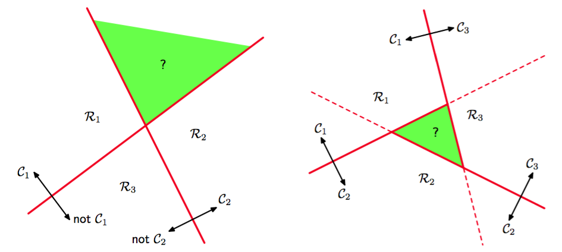
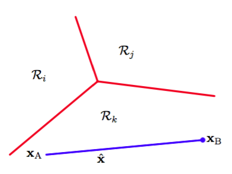

现在把线性判别式推广到$$ K > 2 $$个类别的情况，我们可能会尝试组合多个二分类判别式来构造一个$$ K $$类判别式。然而这会导致一些现在要展示的严重问题（Duda and Hart, 1973）。    

考虑一个包含$$ K-1 $$个把属于类别$$ C_k $$的点与其它的区分开的分类器。这被称为一对其他（one-versus-the-rest）分类器。图4.2的左手边展示了一个涉及三个类别的例子，这种方法会导致空间中有一块类别含糊不清的区域。

      
图 4.2 一对其他分类方法

另一种方法是引入$$ K(K-1)/2 $$个二元判别函数，对每一对类别都设置一个。这被称为一对一（one-versus-one）分类器。然后根据这些判别函数的大多数投票来确定每个点的类别。然而这也会引起类别含糊不清的区域的问题，图4.2的右手边展示。    

引入包含$$ K $$个形式为

$$
y_k(x) = w_k^Tx + w_{k0} \tag{4.9}
$$

的线性函数的单个$$ K $$类判别式，并把点$$ x $$分入对于所有$$ j \neq k $$都有$$ y_k(x) > y_j(x) $$的类$$ C_k $$中，就可以避免这些问题。类$$ C_k, C_j $$间的决策边界由$$ y_k(x) = y_j(x) $$给出，它对应形式为

$$
(w_k - w_j)^Tx + (w_{k0} - w_{j0}) = 0 \tag{4.10}
$$

的$$ (D-1) $$维的超平面。这与4.1.1节讨论的二分类情况下的决策边界具有相同的形式，因此也有类似的几何性质。    

这样的判别式得到的决策区域总是单连通且凸的。为了证明这个，让我们考虑图4.3中展示的，两个都位于决策区域$$ R_k $$中的点$$ x_A,x_B $$。

      
图 4.3 多类判别函数的决策区域的说明   

任何一个在连接$$ x_A,x_B $$线段上的点$$ \hat{x} $$可以表示为

$$
\hat{x}=\lambda x_A + (1-\lambda)x_B \tag{4.11}
$$

其中$$ 0 \leq \lambda \leq 1 $$。根据判别函数的线性性，可以得到

$$
y_k(\hat{x}) = \lambda y_k(x_A) + (1-\lambda)y_k(x_B) \tag{4.12}
$$

因为$$ x_A, x_B $$都在$$ R_k $$中，所以对于所有$$ j \neq k $$都满足$$ y_k(x_A) > y_j(x_A),  y_k(x_B) > y_j(x_B) $$，所以$$ y_k(\hat{x}) > y_j(\hat{x}) $$，所以$$ \bar{x} $$在$$ R_k $$中。因此$$ R_k $$是单连通且凸的。    

注意，对于二分类的情形，我们既可以使用这里讨论的基于两个判别函数$$ y_1(x), y_2(x) $$方法，也可以使用4.1.1节给出基于单一的判别函数$$ y(x) $$的更简单的但等价的方法。    

现在，我们开始探讨三种线性判别函数的参数学习方法，即基于最小二乘、Fisher线性判别式，以及感知算法。    

