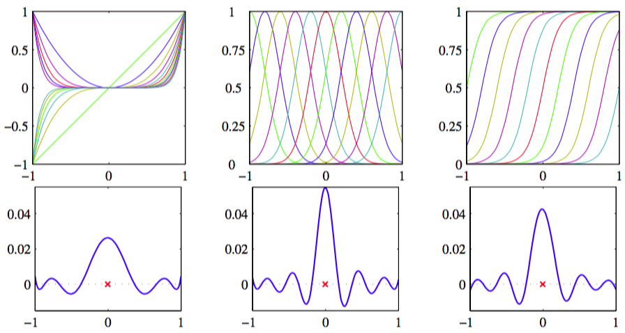

为了利用核替换，我们需要能够构造有效的核函数。一种方法是选择一个特征空间映射$$ \phi(x) $$，然后使用这个映射寻找对应的核，如图6.1所示。    

      
图 6.1 从对应的基函数集合构建核函数的例子    

这里，一维空间的核函数被定义为    

$$
k(x,x') = \phi(x)^T\phi(x') = \sum\limits_{i=1}^M\phi_i(x)\phi_i(x') \tag{6.10}
$$

其中$$ \phi_i(x) $$是基函数。    

另一种方法是直接构造核函数。在这种情况下，我们必须确保我们核函数是有效的，即它对应于某个（可能是无穷维）特征空间的标量积。作为一个简单的例子，考虑下面的核函数    

$$
k(x,z) = (x^T,z)^2 \tag{6.11}
$$

如果我们取二维输入空间$$ x=(x_1,x_2) $$的特殊情况，那么我们可以展开这一项得到的非线性特征映射：

$$
\begin{eqnarray}
k(x,z) &=& (x^Tz)^2 = (x_1z_1 + x_2z_2)^2 \\
&=& x_1^2z_1^2 + 2x_1z_1x_2z_2 + x_2^2z_2^2 \\
&=& (x_1^2,\sqrt{2}x_1x_2,x_2^2)(z_1^2,\sqrt{2}z_1z_2,z_2^2)^T \\
&=& \phi(x)^T\phi(z) \tag{6.12}
\end{eqnarray}
$$

我们看到特征映射的形式为$$ \phi(x)=(x_1^2, \sqrt{2}x_1x_2, x_2^2)^T $$，因此这个特征映射由所有具有具体系数的二阶项组成。    

但是，更一般地，我们需要找到一种更简单的方法检验一个函数是否是一个有效的核函数，而不需要显示的构造函数$$ \phi(x) $$。核函数$$ k(x,x') $$是一个有效的核函数的充分必要条件是Gram矩阵（元素由$$ k(x_n, x_m) $$给出）在所有的集合$$ \{x_n\} $$的选择下都是半正定的（Shawe-Taylor and Cristianini, 2004）。注意，一个半正定的矩阵与元素全部非负的矩阵不同。    

构造新的核函数的一个强大的方法是使用简单的核函数作为基本的模块来构造。可以使用下面的性质来完成这件事：    

> ### 构造新核的技术    
> 
> 给定有效的核$$ k_1(x,x') $$和$$ k_2(x, x') $$，下面的新核也是有效的    
> 
> $$ \begin{eqnarray} k(x,x') &=& k_1(x,x') \tag{6.13} \\ k(x,x') &=& f(x)k_1(x,x')f(x') \tag{6.14} \\ k(x,x') &=& q(k_1(x,x')) \tag{6.15} \\ k(x,x') &=& exp(k_1(x,x')) \tag{6.16} \\ k(x,x') &=& k_1(x,x') + k_2(x,x') \tag{6.17} \\ k(x,x') &=& k_1(x,x')k_2(x,x') \tag{6.18} \\ k(x,x') &=& k_3(\phi{x},\phi{x'}) \tag{6.19} \\ k(x,x') &=& x^TAx' \tag{6.20} \\ k(x,x') &=& k_a(x_a,x_a') + k_b(x_b,x_b') \tag{6.21} \\ k(x,x') &=& k_a(x_a,x_a')k_b(x_b,x_b') \tag{6.22} \end{eqnarray} $$
> 
> 其中$$ c > 0 $$是一个常数，$$ f(\dot) $$是任意函数，$$ q(\dot) $$是一个系数非负的多项式，$$ \phi(x) $$是一个从$$ x $$到$$ \mathbb{R}^M $$的函数，$$ k_3(\dot, \dot) $$是$$ \mathbb{R}^M $$中的一个有效的核，$$ A $$是一个对称半正定矩阵，$$ x_a, x_b $$是变量（未必不相交），且$$ x = (x_a, x_b) $$。$$ k_a,k_b $$是各自空间的有效的核函数。 

知道了这些性质后，我们可以开始构造适用于具体应用的更复杂的核函数了。我们要求核$$ k(x,x') $$是对称的半正定的，且它表示面向具体应用中$$ x,x' $$之间的适当形式的相似性。这里，我们考虑核函数的几个常见的例子。关于“核工程”的一个更加广泛的讨论，可以参考Shawe-Taylor and Cristianini(2004)。    

我们看到简单的多项式核$$ k(x,x') = (x^Tx')^2 $$值包含二次项。如果我们考虑稍微一般的核$$ k(x, x') = (x^Tx' + c)^2 $$，其中$$ c > 0 $$，那么对应的特征映射$$ \phi(x) $$就会包含常数、线性项和二阶项。同样的$$ k(x, x') = (x^Tx')^M $$包含所有$$ M $$阶的单项式。如：如果$$ x,x' $$$是两张图片，那么这个核表示第一张图片中$$ M $$个像素和第二张图片中$$ M $$个像素的所有可能的乘积的一个特定的加权和。这个可以类似地进行推广，使其包含所有次数最高为$$ M $$的项。推广的方式为$$
k(x, x') = (x^Tx' + c)^M $$，其中$$ c > 0 $$。使用式（6.17）和式（6.18）给出的将核函数进行组合的方法，我们看到这些都是有效的核函数。

另一个经常使用的核函数的形式为     

$$
k(x,x') = exp(-\Vert x - x' \Vert^2/2\sigma^2) \tag{6.23}
$$

这经常被称为高斯核。但是注意，在我们现在的讨论中，它不表示概率密度，因此标准化系数被省略了。由于它平方项展开：

$$
\Vert x - x'\Vert^2 = x^Tx + (x')^Tx' - 2x^Tx' \tag{6.24}
$$

从而

$$
k(x,x') = exp\left(-\frac{x^Tx}{2\sigma^2}\right)exp\left(\frac{x^Tx'}{\sigma^2}\right)exp\left(-\frac{(x')^Tx'}{2\sigma^2}\right) \tag{6.25}
$$

然后使用式（6.14）（6.16）以及线性核$$ k(x, x') = x^Tx' $$的有效性，所以这也是一个有效的核。注意，对应于高斯核的特征向量有无穷维的。    

高斯核并不局限于使用欧几里得距离。如果我们使用式（6.24）中的核替换，将$$ x^Tx' $$替换为一个非线性核$$ \kappa(x, x') $$，得到

$$
k(x,x') = exp\left\{-\frac{1}{2\sigma^2}(\kappa(x,x) + \kappa(x',x') - 2\kappa(x,x'))\right\} \tag{6.26}
$$

核观点的一个重要的贡献是可以扩展到符号化的输入，而不是简单的实数向量。核函数可以定义在多种对象上，如图片、集合、字符串、文本文档。考虑一个固定的集合，定义一个非向量空间，这个空间由这个集合的所有可能的子集构成。如果$$ A_1, A_2 $$是两个这样的子集，那么核的一个简单的选择可以是

$$
k(A_1,A_2) = 2^{\vert A_1 \cap A_2 \vert} \tag{6.27}
$$

其中$$ A_1 \cap A_2 $$表示$$ A_1, A_2 $$的交集，$$ \vert A \vart $$表示$$ A $$元素的数量。因为可以证明它对应于一个特征空间中的一个内积，所以这是一个有效的核。    

构造核的另一个强大的方法是从一个概率生成式模型开始构造（Haussler, 1999），这使得我们可以在一个判别式的框架中使用生成式模型。生成式模型可以自然地处理缺失数据，并且在隐马尔科夫模型的情况下，可以处理长度变化的序列。但是，判别式模型在判别式的任务中通常会比生成式模型的表现更好。于是，将这两种方法结合吸引了一些人的兴趣（Lasserre et al., 2006）。一种将二者结合的方法是使用一个生成式模型定义一个核，然后在判别式方法中使用这个核。    

给定一个生成式模型$$ p(x) $$，我们可以定义一个核

$$
k(x,x') = p(x)p(x') \tag{6.28}
$$

很明显，我们可以把它看成由映射$$ p(x) $$定义的一维特征空间中的一个内积，所以这是一个有效的核。它表明，如果两个输入$$ x, x' $$都具有较高的概率，那么它们就是相似的。我们可以使用式（6.13）和（6.17）再通过带有正权值系数$$ p(i) $$，形式为

$$
k(x,x') = \sum\limits_ip(x|i)p(x'|i)p(i) \tag{6.29}
$$

的不同概率分布的乘积的加和来扩展这类核。如果不考虑一个整体的乘法常数，这个核就等价于一个混合概率密度，它可以分解成各个分量概率密度，下标$$ i $$扮演着“潜在”变量的角色。如果两个输入$$ x, x' $$在一大类的不同分量下都有较大的概率，那么这两个输入将会使核函数输出较大的值，因此就表现出相似性。在无限求和的极限情况下，我们也可以考虑

$$
k(x,x') = \int p(x|z)p(x'|z)p(z)dz \tag{6.30}
$$

这样形式的核函数，其中$$ z $$是一个连续潜在变量。    

现在假设我们的数据由长度为$$ L $$的有序序列组成，即一个观测为$$ X = {x_1,...,x_L} $$。对于这种序列，一个流行的生成式模型是隐马尔科夫模型，它把概率$$ p(X) $$表示为对应的隐含状态序列$$ Z = {z_1,...,z_L} $$上的积分或求和。我们可以通过扩展混合表示(6.29)，得到

$$
k(X,X') = \sum\limits_z p(X|Z)p(X'|Z)p(Z) \tag{6.31}
$$

从而两个观测序列都通过相同的隐含序列$$ Z $$生成，来定义的核函数来度量两个序列$$ X, X' $$的相似度。这个模型很容易扩展，使其能够比较不同长度的序列。    

另一个使用生成式模型定义核函数的方法被称为Fisher核（Jaakkola and Haussler, 1999）。 考虑一个参数生成式模型$$ p(x|\theta) $$，其中$$ \theta $$表示参数的向量。目标是找到一个核，度量这个生成式模型的两个输入变量$$ x,x' $$之间的相似性。Jaakkola and Haussler(1999)考虑关于$$ \theta $$的梯度，它定义了一个维度与$$ \theta $$的维度相同的“特征”空间的一个向量。特别地，它们考虑Fisher得分    

$$
g(\theta,x) = \nabla_\theta\ln p(x|\theta) \tag{6.32}
$$

根据Fisher得分，Fisher核被定义为

$$
k(x,x') = g(\theta,x)^TF^{-1}g(\theta,x') \tag{6.33}
$$

这里，$$ F $$是Fisher信息矩阵（Fisher information matrix），定义为    

$$
F = \mathbb{E}_x[g(\theta,x)g(\theta,x)^T] \tag{6.34}
$$

其中，期望是在概率分布$$ p(x|\theta) $$下关于$$ x $$的期望。这样定义的动机可以从信息几何（information geometry）的角度看出来（Amari, 1998），它考虑了模型参数空间的微分几何。这里，我们注意到，Fisher信息矩阵的存在使得这个核在密度模型的非线性重参数化$$ \theta \to \psi(\theta) $$下具有不变性。    

在实际应用中，通常计算Fisher信息矩阵是不可行的。一种方法是把Fisher信息的定义中的期望替换为样本均值，得到    

$$
F \simeq \frac{1}{N}\sum\limits_{n=1}^Ng(\theta,x_n)g(\theta,x_n)^T \tag{6.35}
$$

这是Fisher得分的协方差矩阵，因此Fisher核对应于这些分数的一个漂白。更简单地，我们可以省略Fisher信息矩阵，使用非不变核

$$
k(x,x') = g(\theta,x)^Tg(\theta,x') \tag{6.36}
$$

Hofmann(2000)给出了Fisher核在文档抽取上的一个应用。    

核函数的最后的一个例子定义为

$$
k(x,x') = \tanh(ax^Tx' + b) \tag{6.37}
$$

是sigmoid核，它的Gram矩阵通常不是半正定的。但是这种核在实际应用中也可以使用（Vapnik, 1995），可能是因为它赋予核展开（如支持向量机）一个与神经网络模型的表面的相似性。正如我们将看到的那样，在基函数有无穷多的极限情况下，一个具有恰当先验的贝叶斯神经网络将会变为高斯过程，因此这就提供了神经网络与核方法之间的一个更深层的联系。
