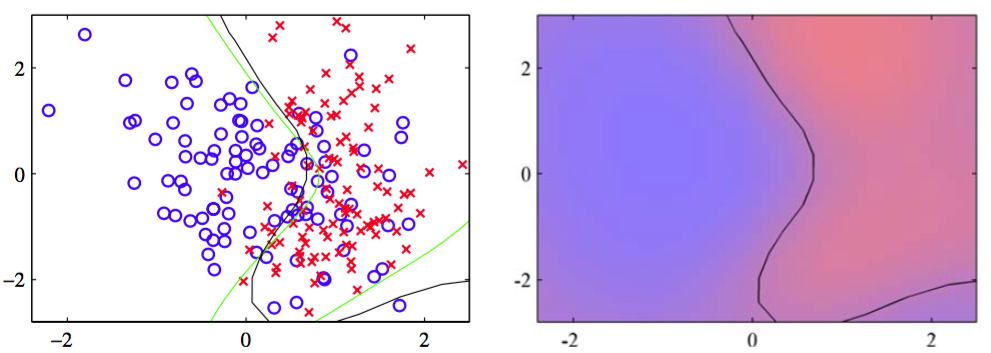

分类的高斯过程的第三中方法是，现在我们要详细讨论的，基于拉普拉斯近似的。为了计算预测分布（6.76），我们寻找$$ a_{N+1} $$的后验分布的高斯近似，它由

$$
\begin{eqnarray}
p(a_{N+1}|t_N) &=& \int p(a_{N+1},a_N|t_N)da_N \\
&=& \frac{1}{p(a_{N+1},a_N)p(t_N|a_{N+1},a_N)da_N \\
&=& \frac{1}{p(a_{N+1},a_N)p(a_N)p(t_N|a_N)da_N \\
&=& \intp(a_{N+1}|a_N)p(a_N|t_N)da_N \tag{6.77}
\end{eqnarray}
$$

其中，我们使用了$$ p(t_N|a_{N+1},a_N) = p(t_N|a_N) $$。条件分布$$ p(a_{N+1}|a_N) $$是通过式（6.66）和式（6.67）给出的高斯过程回归，来给出的：    

$$
p(a_{N+1}|a_N) = \mathcal{N}(a_{N+1}|k^TC_N^{-1}a_N,c-k^TC_N^{-1}k) \tag{6.78}
$$

于是，通过找到后验概率分布$$ p(a_N|t_N) $$的拉普拉斯近似，然后使用两个高斯分布卷积的标准结果，我们就可以计算式（6.77）中的积分。    

先验概率$$ p(a_N) $$由一个均值为0，协方差矩阵为$$ C_N $$，数据项（假设数据点之间具有独立性）由    

$$
p(t_N|a_N) = \prod\limits_{n=1}^N\sigma(a_n)^{t_n}(1-\sigma(a_n))^{1-t_n} = \prod\limits_{n=1}^Ne^{a_nt_n}\sigma(-a_n) \tag{6.79}
$$

高斯过程给出。然后通过对$$ p(a_N|t_N) $$的对数进行泰勒展开，得到拉普拉斯近似。忽略掉一些可加的常数，这个概率对数为：    

$$
\begin{eqnarray}
\Psi(a_N) &=& \ln p(a_N) + \ln p(t_N|a_N) \\
&=& -\frac{1}{2}a_N^TC_N^{-1}a_N - \frac{N}{2}\ln(2\pi) - \frac{1}{2}\ln\vert C_N \vert + t_N^Ta_N \\
& & -\sum\limits_{n=1}^N\ln (1+e^{a_n}) \tag{6.80}
\end{eqnarray}
$$

首先我们需要找到后验概率分布的众数，这需要我们计算$$ \Psi(a_N) $$的梯度。这个梯度为    

$$
\nabla\Psi(a_N) = t_N - \sigma_N - C_N^{-1}a_N \tag{6.81}
$$

其中$$ \sigma_N $$是一个元素为$$ \sigma(a_n) $$的向量。寻找众数时，因为$$ \sigma_N, a_N $$的关系是非线性的，所以我们不能简单地令这个梯度等于0，因此我们需要使用基于Newton-Raphson方法的迭代的方法，它给出了一个迭代重加权最小平方（IRLS）算法。这需要求出$$ \Psi(a_N) $$的二阶导数，而这个二阶导数也需要进行拉普拉斯近似，结果为    

$$
\nabla\nabla\Psi(a_N) = -W_N - C_N^{-1} \tag{6.82}
$$

其中$$ W_N $$是一个对角矩阵，元素为$$ \sigma(a_n)(1 − \sigma(a_n)) $$，并且使用了式（4.88）给出的logistic sigmoid函数的导数的结果。注意，这些对角矩阵元素位于区间$$ (0, 1) $$，因此$$ W_N $$是一个正定矩阵。由于$$ C_N $$（以及它的逆矩阵）被构造为正定的，并且由于两个正定矩阵的和仍然是正定矩阵，因此我们看到Hessian矩阵$$ A = −\nabla\nabla\Psi(a_N) $$是正定的，因此后验概率分布$$ p(a_N|t_N)
$$是对数凸函数，因此有一个唯一的众数，即全局最大值。然而，因为Hessian矩阵是$$ a_N $$的函数，所以后验概率不是高斯分布。    

使用Newton-Raphson式（4.92），$$ a_N $$的迭代更新方程为    

$$
a_N^{new} = C_N(I + W_NC_N)^{-1}\{t_N - \sigma_N + W_Na_N\} \tag{6.83}
$$

这个方程反复迭代，直到收敛于众数（记作$$ a_N^* $$）。在这个众数位置，梯度$$ \nabla\Psi(a_N) $$为0，因此$$ a_N^* $$满足    

$$
a_N^* = C_N(t_N - \sigma_N) \tag{6.84}
$$

一旦我们找到了后验概率的众数$$ a_N^* $$，我们就可以计算Hessian矩阵，结果为    

$$
H = -\nabla\nabla\Psi(a_N) = W_N + C_N^{-1} \tag{6.85}
$$

其中$$ W_N $$的元素使用$$ a_N^* $$计算。这定义了我们对后验概率分布$$ p(a_N|t_N) $$的高斯近似，结果为    

$$
q(a_N) = \mathcal{N}(a_N|a_N^*,H^{-1}) \tag{6.86}
$$

我们现在可以将这个结果与式（6.78）结合，然后计算积分（6.77）。因为这对应于线性高斯模型，我们可以使用一般的结果（2.115）得到    

$$
\begin{eqnarray}
\mathbb{E}[a_{N+1}|t_N] &=& k^T(t_N - \sigma_N) \tag{6.87} \\
var[a_{N+1}|t_N] &=& c - k^T(W_N^{-1} + C_N)^{-1}k \tag{6.88}
\end{eqnarray}
$$    

现在我们有一个$$ p(a_{N+1}|t_N) $$的高斯分布，我们可以使用式（4.153）的近似积分（6.76）。与4.5节的贝叶斯logistic回归模型相同，如果我们只对对应于$$ p(t_{N+1}|t_N)=0.5 $$的决策边界感兴趣，那么我们只需考虑均值，可以忽略方差的效果。     

我们还需要确定协方差函数的参数$$ \theta $$。一种方法是最大化似然函数$$ p(t_N|\theta) $$，此时我们需要对数似然函数和它的梯度的表达式。如果必要的话，还可以加上正则化项，产生一个正则化的最大似然解。最大似然函数的定义为    

$$
p(t_N|\theta) = \int p(t_N|a_N)p(a_N|\theta)da_N \tag{6.89}
$$

这个积分没有解析解,所以我们需要再次使用拉普拉斯近似。使用式（4.135）的结果，我们得到了下面的对数似然函数的近似    

$$
\ln p(t_N|\theta) = \Psi(a_N^*) - \frac{1}{2}\ln \vert W_N + C_N^{-1} \vert + \frac{N}{2}\ln(2\pi) \tag{6.90}
$$

其中$$ \Psi(a_N^*) = \ln p（a_N^*|\theta) + \ln p(t_N|a_N^*) $$。我们还需要计算$$ \ln p(t_N|\theta) $$关于参数向量$$ \theta $$梯度。注意，$$ \theta $$的改变会造成$$ a_N^* $$的改变，产生梯度中的附加项。因此，当我们对（6.90）关于$$ \theta $$求积分时，我们得到了两个项的集合，第一个集合产生于协方差矩阵$$ C_N $$对$$ \theta $$的依赖关系，第二个集合产生于$$ a_N^* $$对$$ \theta $$的依赖关系。

显式地依赖于$$ \theta $$的项可以使用式（6.80）以及式（C.21）（C.22）给出的结果得到：   

$$
\begin{eqnarray}
\frac{\partial\ln p(t_N|\theta)}{\partial\theta_j} = &\frac{1}{2}&a_N^*C_N^{-1}\frac{\partial C_N}{\partial\theta_j}C_N^{-1}a_N^* \\
& & -\frac{1}{2}\Tr \left[(I + C_NW_N)^{-1}W_N\frac{\partial C_N}{\partial \theta_j}\right] \tag{6.91}
\end{eqnarray}
$$

为了计算由于$$ a_N^* $$对$$ \theta $$的依赖产生的项，我们注意到我们已经构造了拉普拉斯近似，从而在$$ a_N =a_N^* $$处，$$ \Psi(a_N) $$的均值为0，所以$$ \Psi(a_N^*) $$对于梯度没有贡献。剩下的有贡献的项关于$$ \theta $$的分量$$ \theta_j $$的导数为    

$$
\begin{eqnarray}
&-&\frac{1}{2}\sum\limits_{n=1}^N\frac{\partial\ln\vert W_N + C_N^{-1} \vert}{\partial a_n^*}\frac{\partial a_n^*}{\partial\theta_j} \\
&=& -\frac{1}{2}\sum\limits_{n=1}^N\left[\left(I + C_NW_N\rigjt)^{-1}C_N\right]_{nn}\sigma_n^*(1-\sigma_n^*)(1-2\sigma_n^*)\frac{\partial a_n^*}{\partial\theta_j} \tag{6.92}
\end{eqnarray}
$$    

其中$$ \sigma_n^* = \sigma(a_n^*) $$，且又一次使用了式（C.22）给出的结果及$$ W_N $$的定义。我们可以将式（6.84）给出的关系关于$$ \theta_j $$求积分，得到$$ a_N^* $$关于$$ \theta_j $$的导数：

$$
\frac{\partial a_n^*}{\partial\theta_j} = \frac{\partial C_N}{\partial\theta_j}(t_N - \sigma_N) - C_NW_N\frac{\partial a_n^*}{\partial\theta_j} \tag{6.93}
$$

整理，可得    

$$
\frac{\partial a_n^*}{\partial\theta_j} = (I + W_NC_N)^{-1}\frac{\partial C_N}{\partial\theta_j}(t_N - \sigma_N) \tag{6.94}
$$    

结合公式（6.91）、（6.92）和（6.94），我们可以计算对数似然函数的梯度，然后使用标准非线性优化算法来确定$$ \theta $$的值。    

我们可以使用人工生成的两类数据来说明拉普拉斯近似对于高斯过程的应用，如图6.12 所示。

      
图 6.5 使用高斯过程进行分类的说明。左图给出了数据点，以及来自真实概率分布的最优决策边界（绿色），还有来自高斯过程分类器的决策边界（黑色）。右图给出了蓝色类别和红色类别的预测后验概率分布，以及高斯过程决策边界。    

很容易将拉普拉斯近似推广到涉及$$ K > 2 $$个类别的使用softmax激活函数的高斯过程 (Williams and Barber, 1998)。
