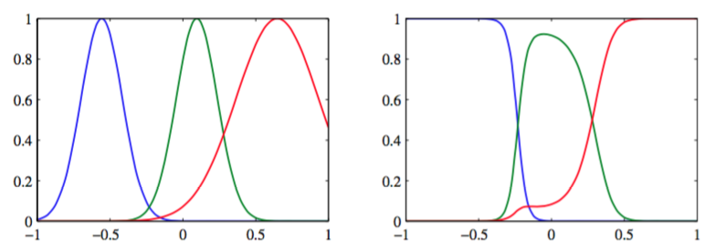

在第3章，我们讨论了基于固定基函数的线性组合的回归模型，但是我们没有详细讨论可以取哪种形式的基函数。一种广泛使用的基函数是径向基函数（radial basis functions）。径向基函数中，每一个基函数只依赖于样本和中心$$ \mu_j $$之间的径向距离（通常是欧几里得距离），即$$ \phi_j(x) = h(\Vert x − \mu_j \Vert) $$。    

历史上，径向基函数被用来进行精确的函数插值（Powell, 1987）。给定一组输入向量$$ \{x_1,...,x_N\} $$以及对应的目标值$$ {t_1,...,t_N\} $$，目标是找到一个光滑的函数$$ f(x) $$。将$$ f(x) $$表示为径向基 函数的线性组合，每个径向基函数都以数据点为中心，即

$$
f(x) = \sum\limits_{n=1}^Nw_nh(\Vert x-x_n \Vert) \tag{6.38}
$$

系数$$ \{w_n\} $$的值由最小平方方法求出。并且，由于具有与系数数量相同的限制条件，因此结果是一个能够精确拟合每个目标值的函数，即对于$$ n=1,...,N $$，都有$$ f(x_n) = t_n $$。但是，在模式识别应用中，目标值通常带有噪声，所以精确插值对应于一个过拟合的解，所以这不是我们想要的。    

对径向基函数的展开来自正则化理论（Poggio and Girosi, 1990; Bishop, 1995a）。对于一个使用微分操作定义的带有正则化项的平方和误差函数，最优解可以通过对算符的Green函数（类似 于离散矩阵的特征向量）进行展开，每个数据点有一个基函数。如果微分算符是各向同性的，那么Green函数只依赖于与对应的数据点的径向距离。由于正则化项的存在，因此解不再精确地对训练数据进行插值。      

径向基函数的另一个研究动机来源于输入变量（而不是目标变量）具有噪声时的插值问题（Webb, 1994; Bishop, 1995a）。如果输入变量$$ x $$上的噪声由一个服从分布$$ v(\xi) $$的变量$$ \xi $$描述，那么平方和误差函数就变成了    

$$
E = \frac{1}{2}\sum\limits_{n=1}^N\int \{y(x_n + \xi) - t_n\}^2v(\xi)d\xi \tag{6.39}
$$

使用变分法，我们可以关于函数$$ y(x) $$进行最优化，得到     

$$
y(x) = \sum\limits_{n=1}^N t_nh(x-x_n) \tag{6.40}
$$

其中基函数为

$$
h(x-x_n) = \frac{v(x-x_n)}{\sum\limits_{n=1}^Nv(x-x_n)} \tag{6.41}
$$

我们看到这是一个以每个数据点为中心的基函数。这被称为Nadaraya-Watson模型。在6.3.1节， 我们会从一个不同的角度再次推导出这个模型。如果噪声分布$$ v(\xi) $$是各向同性的，即它只是$$ \Vert \xi \Vert $$的一个函数，那么基函数就是径向的。     

注意，基函数(6.41)是标准化的，即对于所有的$$ x $$值都有$$ \sum_n h(x − x_n) = 1 $$。这种标准化的效果如图6.2所示。

      
图 6.2 左图给出了一组高斯基函数的图像，右图给出了对应的归一化的基函数的图像。

有时在实际应用中会用到标注啊，因为它避免了输入空间中存在所有的基函数全部取较小值的区域，这种区域会导致在这些区域的预测值过小，或完全由基参数控制。    

另一个展开归一化径向基函数的情况是把核密度估计应用到回归问题中，正如我们将在6.3.1 节讨论的那样。    

由于每一个数据点都关联了一个基函数，因此当对于新的数据点进行预测时，对应的模型的计算开销会非常大。因此一些新的模型被提出来（Broomhead and Lowe, 1988; Moody and Darken, 1989; Poggio and Girosi, 1990），这些模型仍然对径向基函数进行展开，但是基函数的数量$$ M $$要小于数据点的数量$$ N $$。通常，基函数的数量，以及它们的中心$$ \mu_i $$，都只是基于输入数据$$ \{x_n\} $$自身来确定。然后基函数被固定下来，系数$$ \{w_i\}
$$由最小平方方法通过解线性方程的方式确定，正如3.1.1节讨论的那样。    

选择基函数中心的一种最简单的方法是使用数据点的一个随机选择的子集。一个更加系统化的方法被称为正交最小平方（Chen et al., 1991）。这是一个顺序选择的过程，在每一个步骤中，被选择作为基函数的下一个数据点对应于能够最大程度减小平方和误差的数据点。展开系数值的确定是算法的一部分。还可以使用聚类算法（如$$ K $$均值算法），这时得到的一组基函数中心不再与训练数据点重合。
