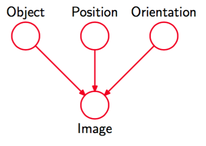

许多情况下，我们希望从给定的概率分布中抽取样本。虽然我们将在第11章用整章的篇幅讨论取样方法，但是这里简要介绍一种方法是很有意义的。这种方法被称为祖先取样（ancestral sampling），与图模型相关性非常高。考虑$$ K $$个变量的一个联合概率分布$$ p(x_1,...,x_K)
$$，它根据式（8.5）进行分解，对应于一个有向无环图。我们假设变量已经进行了排序，从而不存在从某个结点到序号较低的结点的链接。换句话说，每个结点的序号都大于它的父结点。我们的目标是从这样的联合概率分布中取样$$ x_1,...,x_K $$。    

为了完成这一点，我们首先选出序号最小的结点，按照概率分布$$ p(x_1) $$取样，记作$$ x_1 $$。然后，顺序计算每个结点，对于结点$$ n $$，根据条件概率$$ p(x_n|pa_n) $$进行取样，其中父结点的变量被设置为它们的取样值。注意，每个阶段，因为父结点对应于已经采样过的序号较小的结点，这些结点的变量总是可以得到的。按具体的概率分布的取样方法将会在第11章详细讨论。一旦我们对最后的变量$$ x_K
$$取样结束，我们就达到了根据联合概率分布取样的目标。为了从对应于变量的子集的边缘概率分布中取样，我们简单地取要求结点的取样值，忽略剩余结点的取样值。如为了从概率分布$$ p(x_2, x_4) $$中取样，我们简单地对联合概率分布取样，然后保留$$ x_2, x_4 $$，丢弃剩余的值$$ \{ \hat{x}_j \neq 2,4 \}。    

对于概率模型的实际应用，通常的情况是，数量众多的变量对应于图的终端结点（表示观测值），较少的变量对应于潜在变量。潜在变量的主要作用是使得观测变量上的复杂分布可以表示为由简单条件分布（通常是指数族分布）构建的模型。    

我们可以将这样的模型表示为观测数据产生的过程。例如，考虑一个模式识别的任务，其中每个观测值对应于一幅图像（由像素灰度值的向量组成）。这种情况下，潜在变量可以看成物体的位置或者方向。给定一个特定的观测图像，我们的目标是找到物体上的后验概率分布，其中我们对于所有可能的位置和方向进行了积分。我们可以使用图8.8的图模型表示这个问题。    

      
图 8.8 一个图模型，表示物体的图像的创建过程。其中，物体的种类（一个离散变量）以及物体的位置和方向（连续变量）具有独立的先验概率。图像（一个像素灰度值的向量）的概率分布与物体的种类以及它的位置和方向无关。

图模型描述了生成观测数据的一种因果关系（causal）过程（Pearl, 1988）。因此，这种模型通常被称为生成式模型（generative model）。相反，图8.5描述的多项式回归模型因为没有与输入变量x相关联的概率分布，所以不是生成式模型，因此无法从这个模型中人工生成数据点。通过引入合适的先验概率分布$$ p(x) $$，我们可以将模型变为生成式模型，代价是增加了模型的复杂度。    

然而，概率模型中的隐含变量不必具有显式的物理含义。它的引入可以仅仅为了从更简单的成分中建立一个更复杂的联合概率分布。在任何一种情况下，应用于生成式模型的祖先取样方法都模拟了观测数据的创造过程，因此可以产生“幻想的”数据，它的概率分布（如果模型完美的表示现实）与观测数据的概率分布相同。在实际应用中，从一个生成式模型中产生人工生成的观测数据，对于理解模型所表示的概率分布形式很有帮助。
